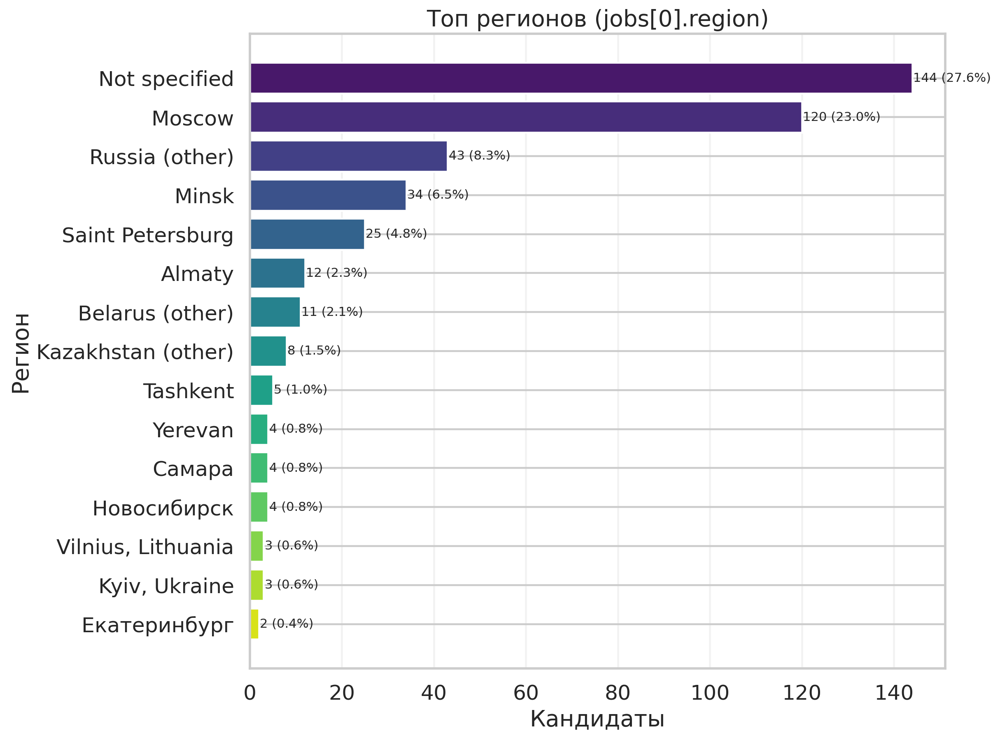
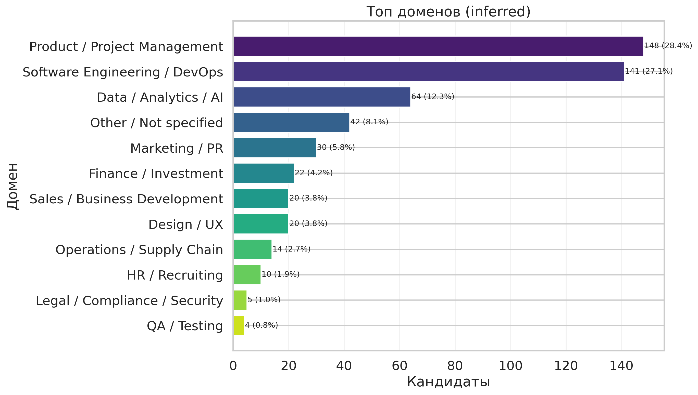
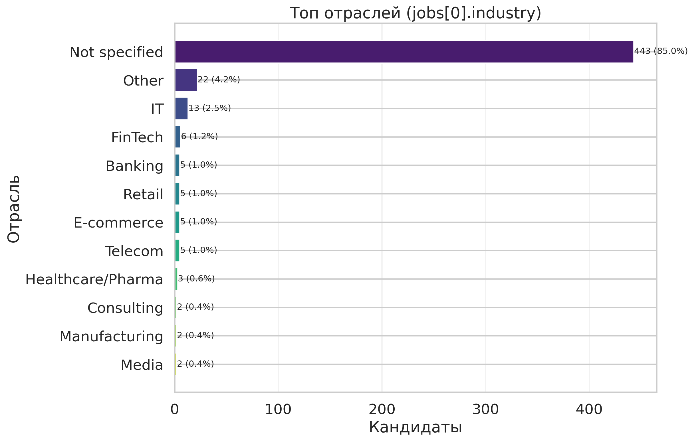
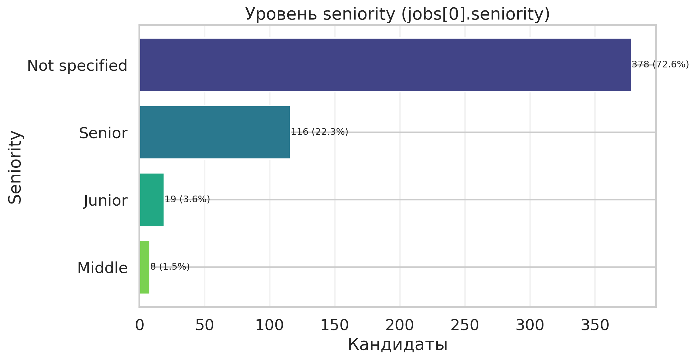
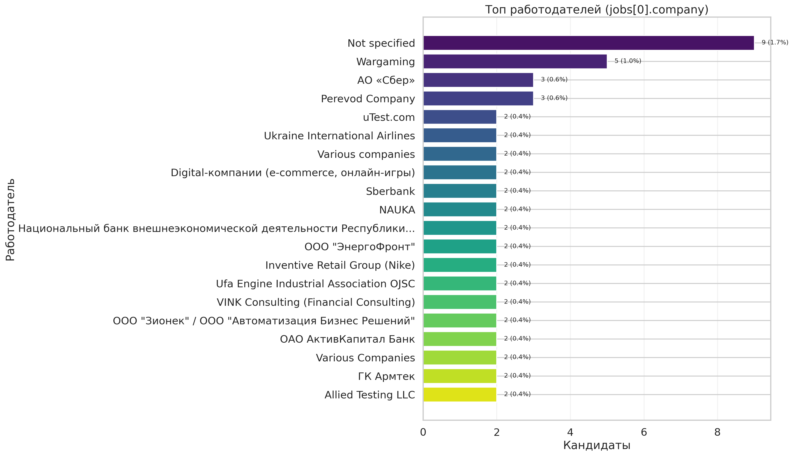
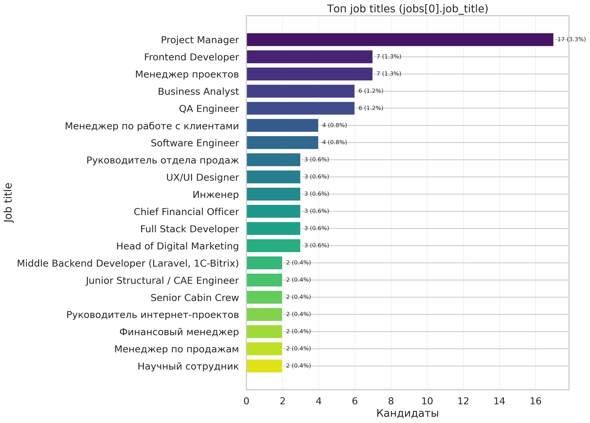
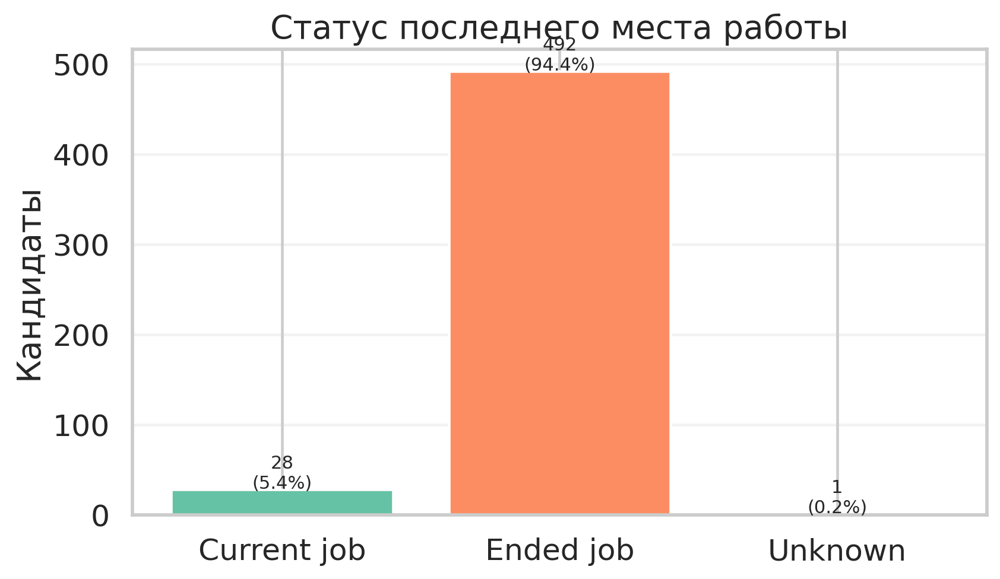

# MIS Report: Candidate Base Analytics

## Scope
- Source: `/Users/k/Downloads/prointerview-prod.users.csv`
- Date filter: `createdAt` in **2026-02-26 — 2026-02-27 (UTC)**
- Cohort condition: non-empty **`cvEnhancedResult`** and **`onboardingCompleted=True`**

## Important Note on Filtering
- В датасете нет отдельного timestamp-поля для момента генерации `cvEnhancedResult`.
- Поэтому срез построен по `createdAt` (попадание в базу) + наличию непустого `cvEnhancedResult` + `onboardingCompleted=True`.

## Executive Summary
- В периоде зафиксировано **723** входов в чат-бот.
- В целевой MIS-срез попало **521** fully-onboarded кандидатов (условие: `cvEnhancedResult` + `onboardingCompleted=True`), это **72.1%** от входов периода.
- География последних мест работы концентрируется в **Not specified** (**27.6%**), затем идут другие локации РФ/СНГ.
- По inferred-доменам лидирует **Product / Project Management** (**28.4%**), а по отрасли наблюдается высокий уровень пропусков (`jobs[0].industry`: **85.0%** `Not specified`).

## KPI Snapshot
- Users in period (`createdAt`): **723**
- Users in final cohort (`cvEnhancedResult` + `onboardingCompleted=True`): **521** (72.1% от периода)
- `onboardingCompleted=True` внутри среза: **521** (100.0%)
- Unique users (`userId`) в срезе: **521**
- Parse coverage for `jobs[0].employment_period`: **97.7%**

## Data Quality (Filtered Cohort)
```
talentCard.jobs[0].industry             85.0
talentCard.jobs[0].seniority            72.6
talentCard.jobs[0].region               27.4
talentCard.jobs[0].company               1.7
talentCard.jobs[0].employment_period     0.2
createdAt                                0.0
cvPath                                   0.0
cvAnalysisResult                         0.0
cvEnhancedResult                         0.0
onboardingCompleted                      0.0
talentCard.jobs[0].job_title             0.0
```

## Last Job Insights (`talentCard.jobs[0]`)
### Top Regions
```
                    count  share_%
last_region_group                 
Not specified         144     27.6
Moscow                120     23.0
Russia (other)         43      8.3
Minsk                  34      6.5
Saint Petersburg       25      4.8
Almaty                 12      2.3
Belarus (other)        11      2.1
Kazakhstan (other)      8      1.5
Tashkent                5      1.0
Yerevan                 4      0.8
Самара                  4      0.8
Новосибирск             4      0.8
Vilnius, Lithuania      3      0.6
Kyiv, Ukraine           3      0.6
Екатеринбург            2      0.4
```


### Top Domains (Inferred from `selectedPosition` + `jobs[0].job_title` + industry)
```
                               count  share_%
domain_inferred                              
Product / Project Management     148     28.4
Software Engineering / DevOps    141     27.1
Data / Analytics / AI             64     12.3
Other / Not specified             42      8.1
Marketing / PR                    30      5.8
Finance / Investment              22      4.2
Sales / Business Development      20      3.8
Design / UX                       20      3.8
Operations / Supply Chain         14      2.7
HR / Recruiting                   10      1.9
Legal / Compliance / Security      5      1.0
QA / Testing                       4      0.8
```


### Top Industries
```
                     count  share_%
last_industry_group                
Not specified          443     85.0
Other                   22      4.2
IT                      13      2.5
FinTech                  6      1.2
Banking                  5      1.0
Retail                   5      1.0
E-commerce               5      1.0
Telecom                  5      1.0
Healthcare/Pharma        3      0.6
Consulting               2      0.4
Manufacturing            2      0.4
Media                    2      0.4
```


### Seniority Distribution
```
                count  share_%
last_seniority                
Not specified     378     72.6
Senior            116     22.3
Junior             19      3.6
Middle              8      1.5
```


### Top Last Employers
```
                                                                           count  share_%
last_company                                                                             
Not specified                                                                  9      1.7
Wargaming                                                                      5      1.0
АО «Сбер»                                                                      3      0.6
Perevod Company                                                                3      0.6
uTest.com                                                                      2      0.4
Ukraine International Airlines                                                 2      0.4
Various companies                                                              2      0.4
Digital-компании (e-commerce, онлайн-игры)                                     2      0.4
Sberbank                                                                       2      0.4
NAUKA                                                                          2      0.4
Национальный банк внешнеэкономической деятельности Республики Узбекистана      2      0.4
ООО "ЭнергоФронт"                                                              2      0.4
Inventive Retail Group (Nike)                                                  2      0.4
Ufa Engine Industrial Association OJSC                                         2      0.4
VINK Consulting (Financial Consulting)                                         2      0.4
ООО "Зионек" / ООО "Автоматизация Бизнес Решений"                              2      0.4
ОАО АктивКапитал Банк                                                          2      0.4
Various Companies                                                              2      0.4
ГК Армтек                                                                      2      0.4
Allied Testing LLC                                                             2      0.4
```


### Top Last Job Titles
```
                                               count  share_%
last_job_title                                               
Project Manager                                   17      3.3
Frontend Developer                                 7      1.3
Менеджер проектов                                  7      1.3
Business Analyst                                   6      1.2
QA Engineer                                        6      1.2
Менеджер по работе с клиентами                     4      0.8
Software Engineer                                  4      0.8
Руководитель отдела продаж                         3      0.6
UX/UI Designer                                     3      0.6
Инженер                                            3      0.6
Chief Financial Officer                            3      0.6
Full Stack Developer                               3      0.6
Head of Digital Marketing                          3      0.6
Middle Backend Developer (Laravel, 1C-Bitrix)      2      0.4
Junior Structural / CAE Engineer                   2      0.4
Senior Cabin Crew                                  2      0.4
Руководитель интернет-проектов                     2      0.4
Финансовый менеджер                                2      0.4
Менеджер по продажам                               2      0.4
Научный сотрудник                                  2      0.4
```


## Employment Period Analytics (`jobs[0].employment_period`)
- Current jobs (`present/current` in period string): **28**
- Ended jobs: **492**
- Unknown period: **1**
- Median tenure (parsed): **39.0 months**
- Mean tenure (parsed): **50.9 months**



## Visualizations
1. `figures/01_new_candidates_by_day.png`
2. `figures/03_top_regions.png`
3. `figures/04_top_domains.png`
4. `figures/05_top_industries.png`
5. `figures/06_seniority_distribution.png`
6. `figures/07_top_employers.png`
7. `figures/08_current_vs_ended_job.png`
8. `figures/09_last_job_tenure_months.png`
9. `figures/10_top_job_titles.png`
