# MIS: Users Resume Bot (Candidate Analytics)

## 1) Summary
- Cohort filter (createdAt UTC): **26-27 Feb 2026**
- Sample: **только пользователи с LaTeX CV (`cvEnhancedResult` contains `latex`); N = 521**
- Users total: **521**
- Coverage `cvEnhancedResult`: **100.0%**
- Coverage `talentCard.jobs`: **100.0%**
- Coverage `talentCard.overall_skills`: **100.0%**
- Coverage `talentCard.specialist_category`: **100.0%**

Top-3 domains (excluding Other/Not specified):
| domain                     |   count |
|:---------------------------|--------:|
| Product/Project Management |     235 |
| Finance/Legal/HR           |     137 |
| Engineering/IT             |      59 |

Top-3 regions (excluding Other/Not specified):
| region         |   count |
|:---------------|--------:|
| Москва         |     124 |
| Russia         |      27 |
| Minsk, Belarus |      26 |

Top-3 companies (excluding Other/Not specified):
| company      |   count |
|:-------------|--------:|
| Сбер         |       7 |
| EPAM Systems |       4 |
| Lyft         |       3 |

### Key observations
- Срез MIS ограничен cohort-фильтром по `createdAt` (UTC): 2026-02-26 to 2026-02-27.
- База содержит 521 профилей.
- Покрытие `cvEnhancedResult`: 100.0%.
- Покрытие `talentCard.jobs`: 100.0%.
- Покрытие `talentCard.overall_skills`: 100.0%.
- Покрытие `talentCard.specialist_category`: 100.0%.
- LaTeX-парсинг нашел `ExpHeader` у 99.2% пользователей.
- LaTeX skills section найдена у 100.0% пользователей.
- Гео-мэппинг схлопнул варианты Russia/Россия/РФ: 27 записей перешли в канон `Russia`.
- Industry анализируется только на subset с заполненным industry: 21.5% пользователей.
- `region=Not specified` остается у 7.1% базы; `company=Not specified` — у 0.6%.
- В fallback цепочку региона добавлено альтернативных geo-колонок: 0.
- CV language distribution: en: 52.6%, ru: 47.4%.
- Топ tools: Jira, Confluence, Sql, Miro, Figma.
- Статус занятости: employed 68.3%, not_employed 29.8%, unknown 1.9%.
- Unknown после улучшения парсинга периодов: 10 (1.9%), до улучшения: 10 (1.9%), rescued periods: 0.

## 2) Coverage / Parsing validation
| metric                               |   value |
|:-------------------------------------|--------:|
| users_total                          |   521   |
| coverage_cvEnhancedResult_%          |   100   |
| coverage_talentCard_jobs_%           |   100   |
| coverage_overall_skills_%            |   100   |
| coverage_specialist_category_%       |   100   |
| coverage_industry_talentCard_%       |    21.5 |
| users_with_latex_block               |   521   |
| share_users_with_latex_block_%       |   100   |
| users_with_expheader                 |   517   |
| share_users_with_expheader_%         |    99.2 |
| users_with_skills_section            |   521   |
| share_users_with_skills_section_%    |   100   |
| users_with_languages_section         |   418   |
| share_users_with_languages_section_% |    80.2 |
| users_with_education_section         |    38   |
| share_users_with_education_section_% |     7.3 |
| company_comparable_users             |   512   |
| current_company_matches              |   487   |
| current_company_match_rate_%         |    95.1 |

Columns inventory (real CSV structure + non-null profile + length stats):
- `outputs/tables/columns_inventory.csv`
- `outputs/tables/createdAt_date_counts_all.csv`
- `outputs/tables/createdAt_date_counts_filtered.csv`
- `outputs/tables/latex_coverage_before_filter.csv`

## 3) Domains & Geography
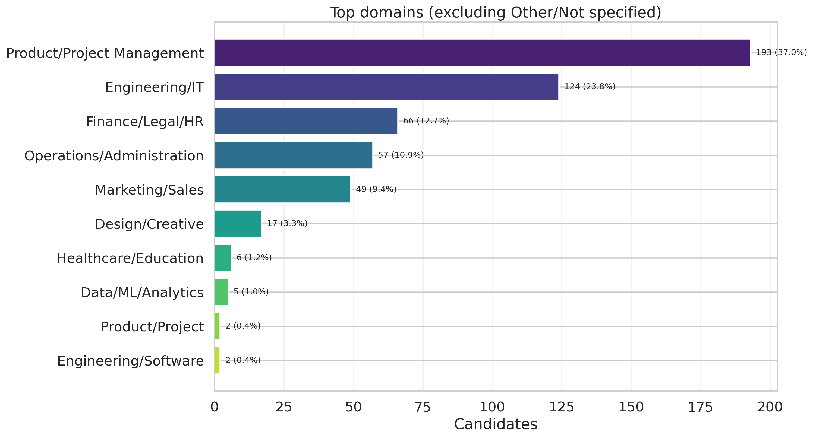

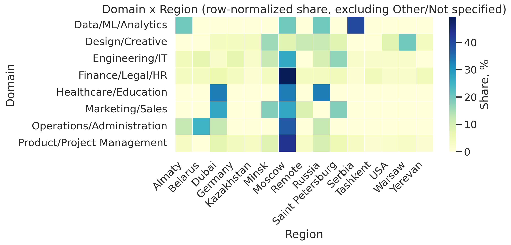
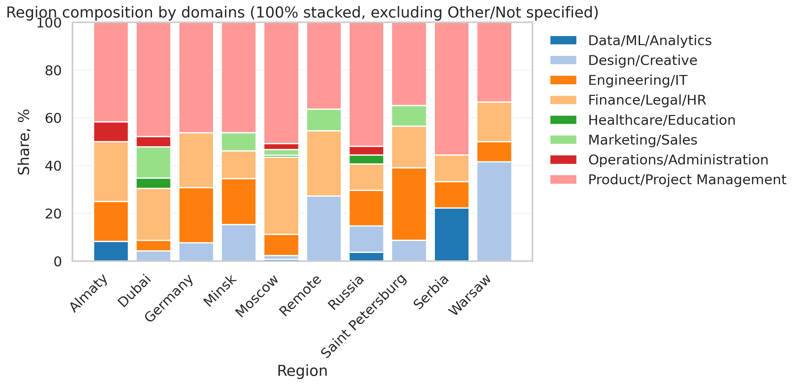

## 4) Companies & Seniority
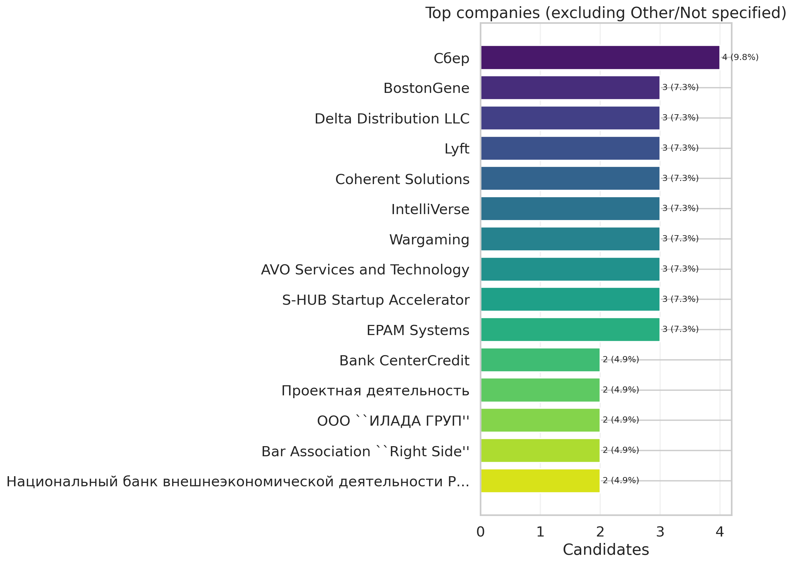
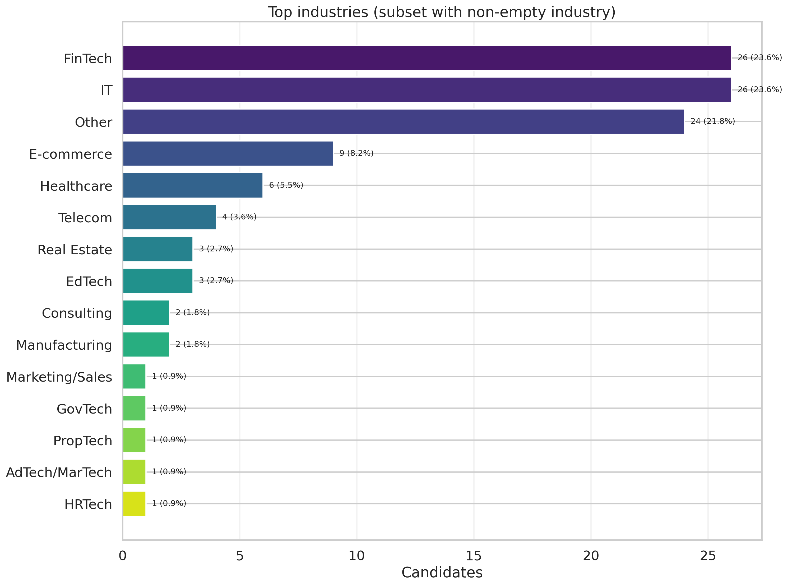
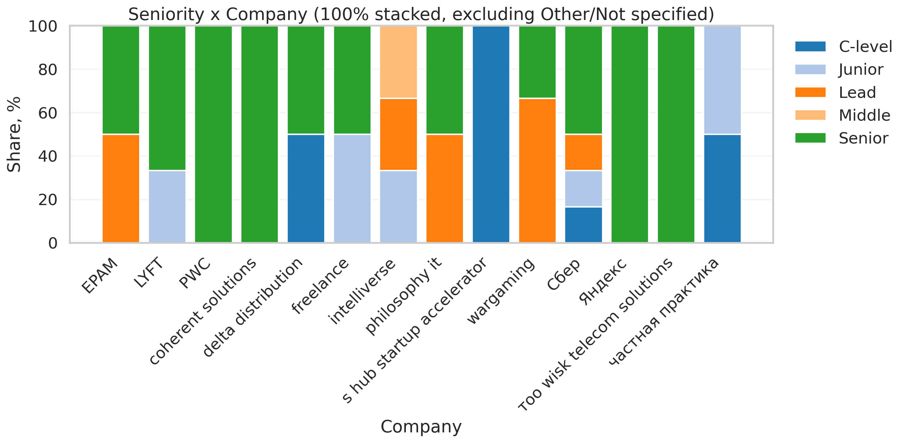
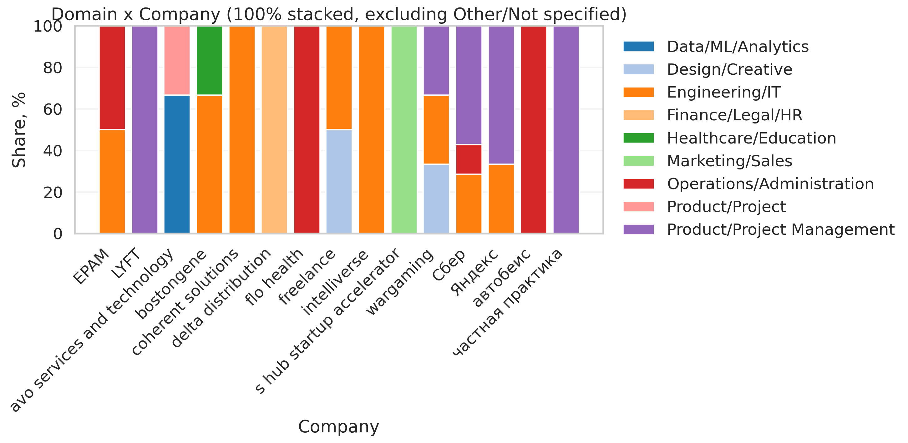

## 5) Skills & Stack
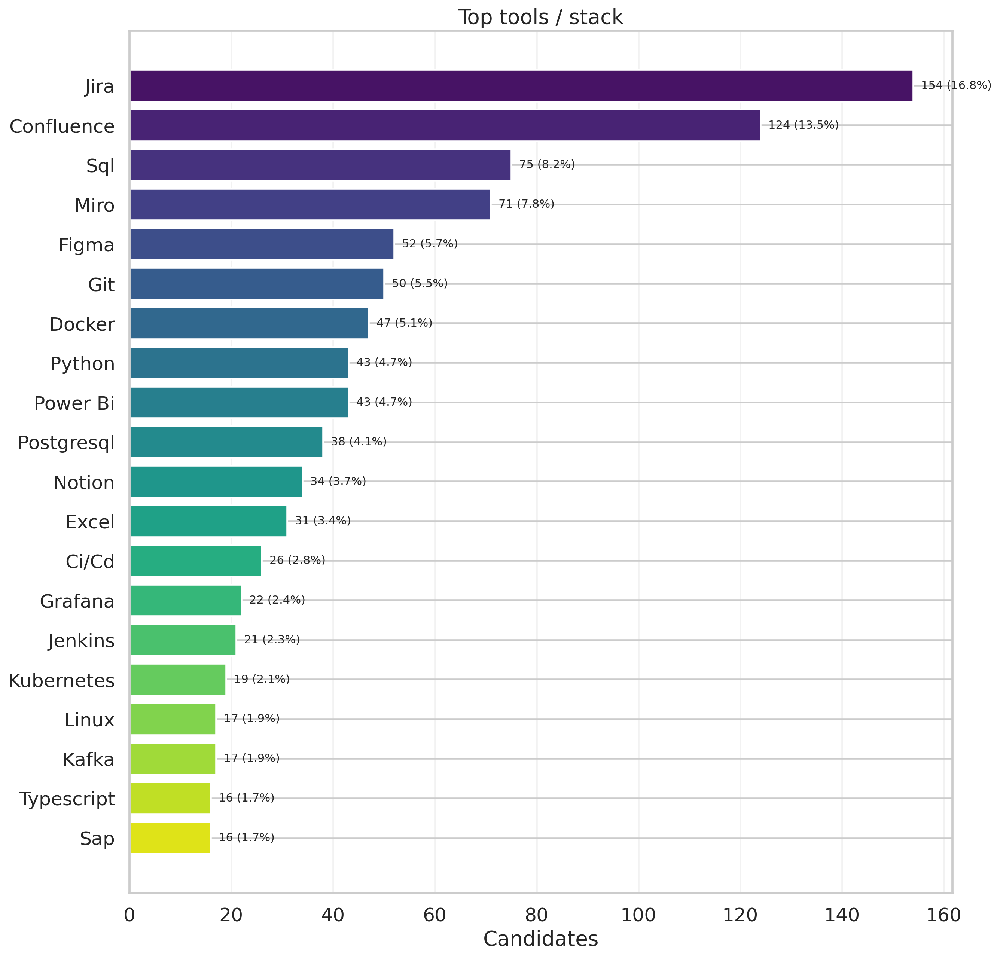

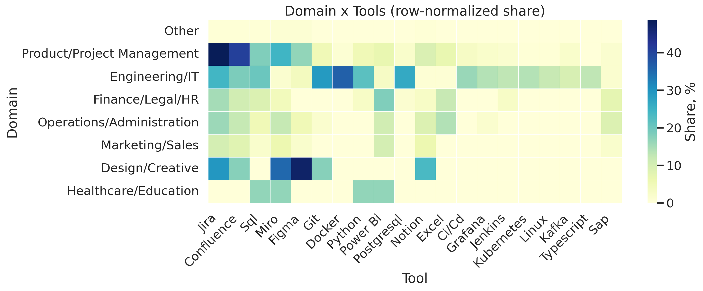

## 6) Стратификация выборки
CV language: `ru/en`.
<p>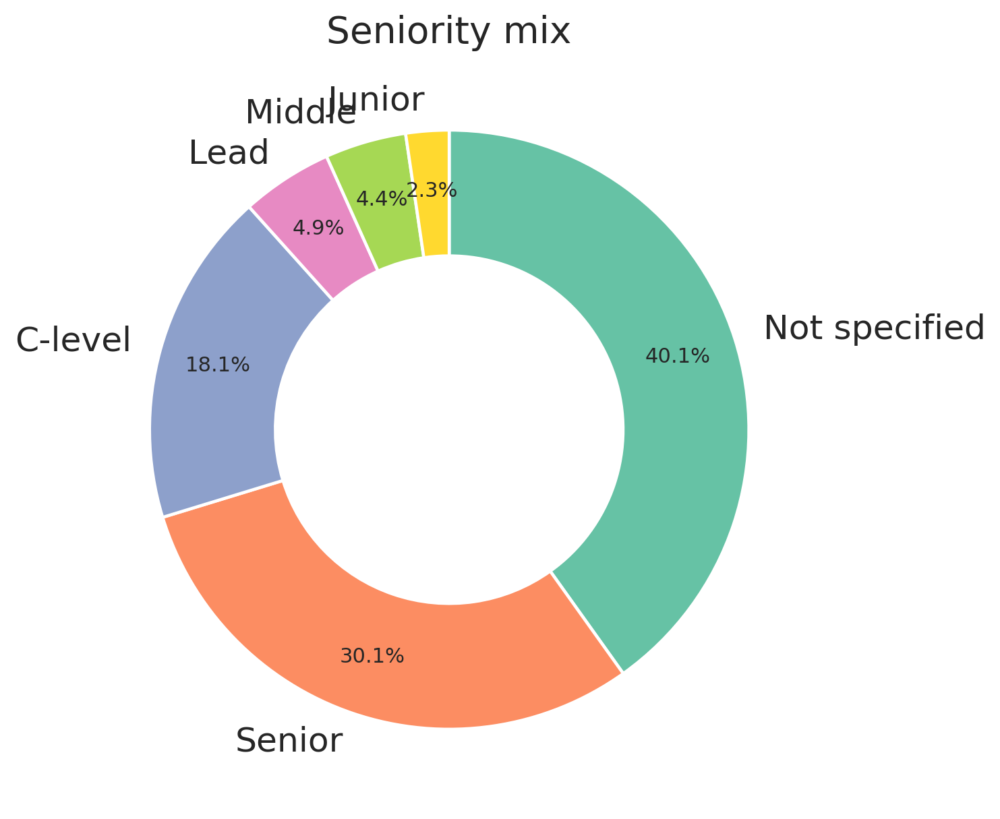</p>

Ключевые таблицы стратификации:
- `outputs/tables/strata_top20.csv`
- `outputs/tables/domain_distribution.csv`
- `outputs/tables/role_family_distribution.csv`
- `outputs/tables/seniority_distribution.csv`
- `outputs/tables/experience_bin_distribution.csv`
- `outputs/tables/leadership_distribution.csv`
- `outputs/tables/cv_generation_language_distribution.csv`
- `outputs/tables/cv_language_coverage.csv`
- `outputs/tables/language_audit.csv`

## 7) Employment status (working vs not working)
| employment_status   |   count |   share_% |
|:--------------------|--------:|----------:|
| employed            |     356 |      68.3 |
| not_employed        |     155 |      29.8 |
| unknown             |      10 |       1.9 |

Ключевые наблюдения:
- Домен с максимальной долей employed: `Data/ML/Analytics` (85.7%).
- Домен с максимальной долей not_employed: `Marketing/Sales` (52.9%).
- Регион с максимальной долей not_employed: `Serbia` (66.7%).
- Сеньорность с максимальной долей not_employed: `C-level` (35.6%).

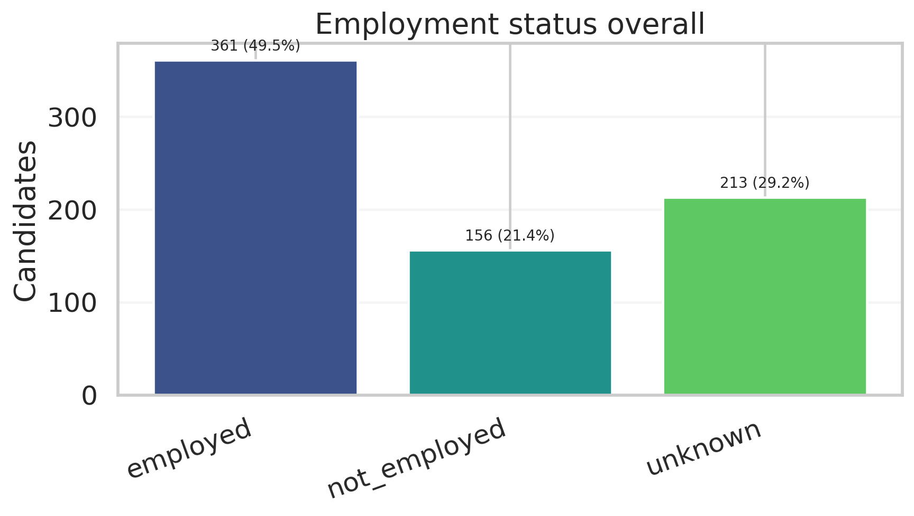


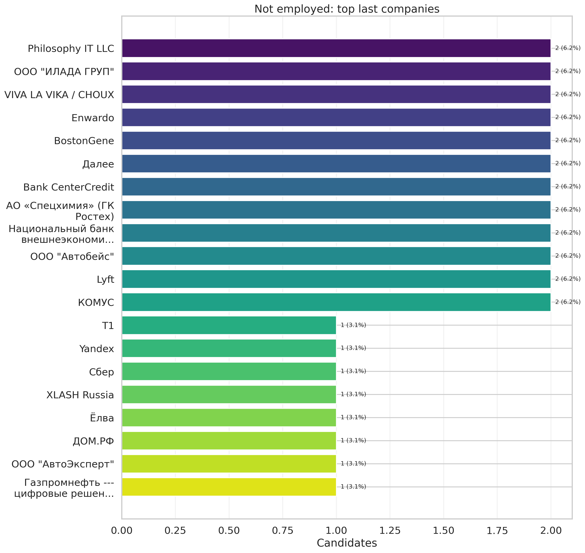
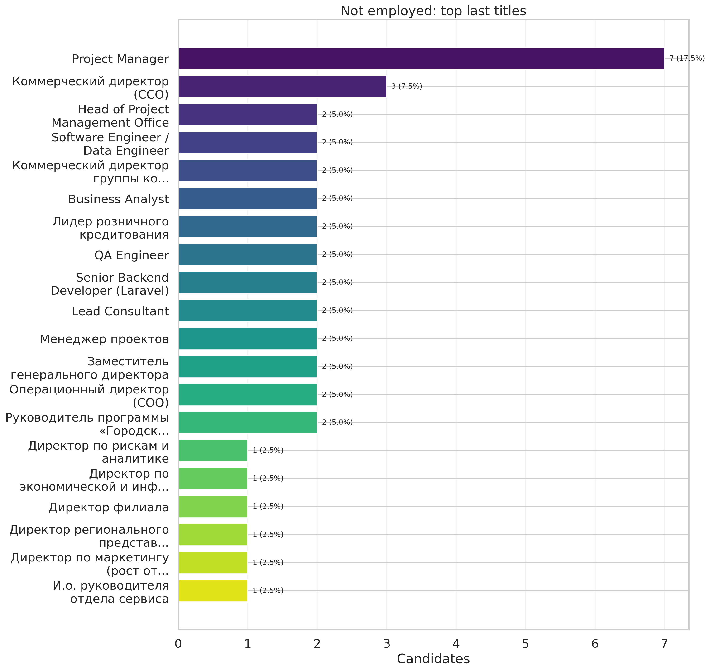
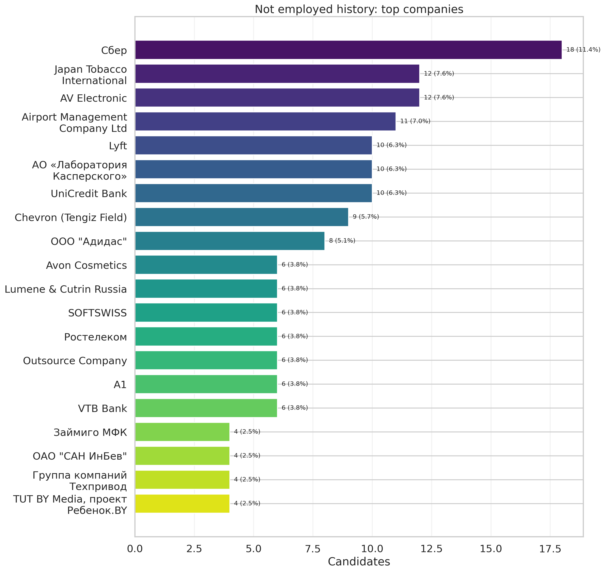

Таблицы employment status:
- `outputs/tables/employment_status_summary.csv`
- `outputs/tables/employment_status_by_domain.csv`
- `outputs/tables/employment_status_by_region.csv`
- `outputs/tables/employment_status_by_seniority.csv`
- `outputs/tables/not_employed_top_last_companies.csv`
- `outputs/tables/not_employed_top_last_titles.csv`
- `outputs/tables/not_employed_months_since_last_end.csv`
- `outputs/tables/not_employed_history_top_companies.csv`
- `outputs/tables/not_employed_history_top_titles.csv`

### Unknown deep dive
- unknown_count: **10** (1.9% of cohort); before parser improvements: **10** (1.9%).
- Top unknown reasons:
  - `other`: 5 (50.0%)
  - `period_present_but_all_parse_failed`: 5 (50.0%)
- Unknown users with jobs but no period: **0.0%**.
- Rescued failed period rows by parser upgrade: **0**.
Links:
- `outputs/tables/employment_unknown_breakdown.csv`
- `outputs/tables/employment_unknown_parse_failed_periods_top.csv`
- `outputs/tables/employment_unknown_examples.csv`
- `outputs/tables/employment_unknown_users.csv`
- `outputs/tables/employment_unknown_crosstab_sources.csv`
- `outputs/tables/employment_unknown_before_after.csv`
- `outputs/tables/employment_unknown_reason_shift.csv`

## 8) Not specified research
| field     |   total_missing_count |   share_missing_% |   share_filled_by_fallback | source_breakdown                                                                            |
|:----------|----------------------:|------------------:|---------------------------:|:--------------------------------------------------------------------------------------------|
| domain    |                     0 |               0   |                       97.9 | inferred:97.9%; talentCard:2.1%                                                             |
| region    |                    37 |               7.1 |                       28.8 | latex_expheader:64.1%; latex_header:19.4%; talentCard:9.4%; not_specified:7.1%              |
| company   |                     0 |               0   |                        0.8 | latex_expheader:99.2%; talentCard:0.8%                                                      |
| seniority |                    90 |              17.3 |                       42.8 | talentCard:39.9%; inferred_job_title:23.2%; inferred_header_role:19.6%; not_specified:17.3% |
| industry  |                   409 |              78.5 |                        0   | not_specified:78.5%; talentCard:21.5%                                                       |

Пустоты уменьшались по fallback-цепочкам:
- `region_filled`: `latex_expheader -> talentCard -> latex_header -> alt_geo_columns`
- `seniority_filled`: `talentCard -> inferred_job_title -> inferred_header_role`
- `domain_filled`: `talentCard.specialist_category -> inferred role family`

Таблицы исследования Not specified:
- `outputs/tables/not_specified_deep_dive_summary.csv`
- `outputs/tables/not_specified_deep_dive_region_not_specified_breakdown.csv`
- `outputs/tables/not_specified_deep_dive_region_not_specified_domain.csv`
- `outputs/tables/not_specified_deep_dive_region_not_specified_seniority.csv`
- `outputs/tables/not_specified_deep_dive_region_alt_columns.csv`
- `outputs/tables/not_specified_deep_dive_company_not_specified_breakdown.csv`
- `outputs/tables/not_specified_deep_dive_company_not_specified_job_titles.csv`
- `outputs/tables/not_specified_deep_dive_company_not_specified_region.csv`

## 9) Domain Other
Исследование домена `Other` вынесено в отдельный отчёт: `REPORT_OTHERS.md`.

## 10) Appendix
Артефакты:
- Figures: `outputs/figures/*.png`
- Tables: `outputs/tables/*.csv`
- Other report: `REPORT_OTHERS.md` + `outputs/others/*`
- Notebook: `notebooks/mis_users_resume_bot.ipynb`
- Geo mapping audit: `outputs/tables/geo_mapping_audit.csv`
- Geo mapping top-50: `outputs/tables/geo_mapping_top50.csv`
- Company mapping collisions: `outputs/tables/company_mapping_collisions.csv`

How to reproduce:
```bash
python analytics/mis_users_resume_bot/src/build_mis.py \
  --input /mnt/data/prointerview-prod.users.csv \
  --base-dir analytics/mis_users_resume_bot
```
