# MIS Report: Users EDA (Resume Bot)

## 1) Executive MIS Summary
- Users in dataset: **730**
- Onboarding completed: **527** (72.2%)
- CV enhanced available: **527** (72.2%)
- Banned users: **60** (8.2%)
- Top role family: **Other** (28.1%)
- Top industry: **Not specified** (84.0%)
- Top country (guess): **Unknown** (88.9%)

### Key Findings
- Основной отток в продуктовой воронке происходит до этапа `onboarding completed`.
- Профили сильно различаются по полноте: большой хвост профилей с низким score из-за отсутствия структурированных job-данных и индустрий.
- В текущем срезе доминируют роли Product/Project и Engineering/Software, с заметным кластером Data/Analytics.
- Доля незаполненных `industry` и частично `region` ограничивает точность отраслевой и гео-аналитики.
- По карьерной динамике встречаются разрывы и пересечения периодов, что важно учитывать в matching/scoring.

## 2) Data Quality & Coverage
Допущения:
- `isBanned`: пустые значения интерпретированы как `False`.
- Периоды вида `present/по н.в.` завершаются датой анализа.
- Для `YYYY-YYYY` парсинг с флагом `year_only`.

### Null Coverage (key fields)
```
                         field  null_%  non_null_%
      talentCard.overall_tools    96.6         3.4
                     banReason    91.8         8.2
talentCard.specialist_category    28.6        71.4
              cvEnhancedResult    27.8        72.2
    talentCard.overall_summary    27.8        72.2
     talentCard.overall_skills    27.8        72.2
              selectedPosition    27.0        73.0
              cvAnalysisResult    21.6        78.4
                        cvPath    21.4        78.6
                     createdAt     0.0       100.0
                     updatedAt     0.0       100.0
           onboardingCompleted     0.0       100.0
                      isBanned     0.0       100.0
```

### Employment Period Parse Quality
```
parse_quality_flag  count
        month_year   1942
           present    392
         year_only    276
            failed     37
             empty      6
```

## 3) Candidate Landscape
### Role Family
```
         role_family  count  share_%
               Other    205     28.1
     Product/Project    186     25.5
   Data/ML/Analytics    123     16.8
Engineering/Software     83     11.4
    Finance/Legal/HR     43      5.9
     Marketing/Sales     41      5.6
    Operations/Admin     35      4.8
              Design     14      1.9
```
### Specialist Category
```
       specialist_category  count  share_%
             Not specified    209     28.6
Product/Project Management    193     26.4
            Engineering/IT    124     17.0
          Finance/Legal/HR     66      9.0
 Operations/Administration     57      7.8
           Marketing/Sales     47      6.4
           Design/Creative     17      2.3
                     Other     11      1.5
      Healthcare/Education      6      0.8
```
### Geography
```
   country  count  share_%
   Unknown    649     88.9
    Russia     23      3.2
       UAE     22      3.0
    Poland     13      1.8
Uzbekistan      5      0.7
Kazakhstan      5      0.7
 Lithuania      5      0.7
   Belarus      4      0.5
   Ukraine      2      0.3
   Armenia      2      0.3
```
### Industry
```
                industry  count  share_%
           Not specified    613     84.0
             IT/Software     26      3.6
         Banking/FinTech     25      3.4
                   Other     24      3.3
       E-commerce/Retail      9      1.2
       Healthcare/Pharma      6      0.8
                 Telecom      5      0.7
             Real Estate      3      0.4
        Education/EdTech      3      0.4
         Media/Marketing      2      0.3
              Consulting      2      0.3
Manufacturing/Industrial      2      0.3
```
### Current Employers (aggregated)
```
                                                                  company  count  share_%
                                                            Not specified    205     28.1
                                                       Coherent Solutions      3      0.4
                                                S-HUB Startup Accelerator      3      0.4
                                                                Wargaming      3      0.4
                                                             EPAM Systems      3      0.4
                                                               BostonGene      3      0.4
                                                   Delta Distribution LLC      3      0.4
                                                             IntelliVerse      3      0.4
                                                                     Сбер      3      0.4
                                                                     Lyft      3      0.4
                                     Data Analytics Experience & Projects      2      0.3
Национальный банк внешнеэкономической деятельности Республики Узбекистана      2      0.3
                                                                 Sberbank      2      0.3
                                                           ООО "Автобейс"      2      0.3
                              Engineering and Manufacturing Solutions JSC      2      0.3
                                                 Иннотех, Группа компаний      2      0.3
                                                               Flo Health      2      0.3
                                                       Фриланс (Литва/РБ)      2      0.3
                                                   Проектная деятельность      2      0.3
                                                                   Yandex      2      0.3
```

## 4) Experience & Career Dynamics
### Tenure / Experience Summary
```
                       metric  value
              users_with_jobs 527.00
  users_with_valid_experience 522.00
median_total_experience_years  14.00
  mean_total_experience_years  14.14
         median_tenure_months  28.50
           mean_tenure_months  39.24
       users_with_career_gaps 259.00
          users_with_overlaps 206.00
```
### Experience Bins
```
experience_bin  count  share_%
           15+    260     35.6
       Unknown    208     28.5
         10-14    121     16.6
           6-9    108     14.8
           3-5     29      4.0
           0-2      4      0.5
```

## 5) Skills & Tools
### Skill Families
```
   skill_family  count
        General    725
         Design      4
Project/Product      1
```
### Top Skills / Tools
```
                 token  count
                  jira    147
            confluence    118
stakeholder management     89
                   sql     80
                kanban     79
                 agile     73
                 scrum     72
                  miro     58
                    ci     52
          agile (scrum     50
                   git     49
                docker     48
                 figma     46
              power bi     43
                python     42
            postgresql     39
                    cd     38
             waterfall     37
                 excel     30
                notion     29
```

## 6) Segmentation
### Text Clusters (TF-IDF + KMeans)
```
 cluster_id  users  median_experience_years      top_role_family top_industry top_country  share_%                                                                               top_terms
          0    279                     19.7                Other                  Unknown     38.2   директор, управление, руководитель, продаж, бюджетирование, управления, развитие, b2b
          6     87                     13.5    Data/ML/Analytics                  Unknown     11.9             design, support, operations, product, business, analyst, designer, analysis
          3     74                     14.5      Marketing/Sales                  Unknown     10.1       management, marketing, development, strategy, sales, leadership, across, business
          7     74                     12.9      Product/Project                  Unknown     10.1  управление, проектов, руководитель, project, manager, delivery, project manager, scrum
          4     72                     13.0      Product/Project                  Unknown      9.9  project, manager, delivery, management, project manager, stakeholder, program, product
          2     56                     12.3    Data/ML/Analytics                  Unknown      7.7                  product, данных, аналитик, sql, требований, анализ, менеджер, продукта
          9     36                      8.3 Engineering/Software                  Unknown      4.9                  testing, test, react, engineer, api, typescript, automation, developer
          8     32                     11.8 Engineering/Software                  Unknown      4.4                 backend, engineer, kubernetes, java, docker, python, spring, postgresql
          5     17                     14.5               Design                  Unknown      2.3 подбора, интервью, руководитель, обучение, recruiter, практики, senior recruiter, найма
          1      3                      7.9     Finance/Legal/HR                  Unknown      0.4                      legal, aml cft, cft, compliance, aml, counsel, regulatory, fintech
```
### Cluster Top Terms
```
 cluster_id                                                                               top_terms
          0   директор, управление, руководитель, продаж, бюджетирование, управления, развитие, b2b
          1                      legal, aml cft, cft, compliance, aml, counsel, regulatory, fintech
          2                  product, данных, аналитик, sql, требований, анализ, менеджер, продукта
          3       management, marketing, development, strategy, sales, leadership, across, business
          4  project, manager, delivery, management, project manager, stakeholder, program, product
          5 подбора, интервью, руководитель, обучение, recruiter, практики, senior recruiter, найма
          6             design, support, operations, product, business, analyst, designer, analysis
          7  управление, проектов, руководитель, project, manager, delivery, project manager, scrum
          8                 backend, engineer, kubernetes, java, docker, python, spring, postgresql
          9                  testing, test, react, engineer, api, typescript, automation, developer
```
### Experience x Role (share %)
```
experience_bin  Data/ML/Analytics  Design  Engineering/Software  Finance/Legal/HR  Marketing/Sales  Operations/Admin  Other  Product/Project
           0-2               25.0     0.0                  75.0               0.0              0.0               0.0    0.0              0.0
         10-14               26.4     1.7                   9.9               7.4              6.6               4.1    0.8             43.0
           15+               16.5     3.1                  15.0              11.2              8.1              11.2    1.5             33.5
           3-5               31.0     0.0                  34.5               3.4              3.4               0.0    0.0             27.6
           6-9               34.3     3.7                  15.7               2.8              8.3               0.9    1.9             32.4
       Unknown                0.5     0.0                   1.0               0.5              1.0               0.0   95.2              1.9
```
### Leadership x Role (share %)
```
leadership_level  Data/ML/Analytics  Design  Engineering/Software  Finance/Legal/HR  Marketing/Sales  Operations/Admin  Other  Product/Project
            High               11.4     1.2                  12.0              13.2             11.4              15.6    1.8             33.5
             Low               14.4     1.2                   9.1               2.2              2.9               1.2   48.3             20.7
          Medium               29.9     4.8                  17.0               8.2              6.8               2.7    0.7             29.9
```

## 7) Profile Quality Scorecard
### Score Distribution
```
bucket  count  share_%
91-100    327     44.8
  0-40    203     27.8
 76-90    199     27.3
 61-75      1      0.1
```
### Score Components
```
           component  avg_value
     summary_present      0.722
      skills_present      0.722
        jobs_present      0.722
            resp_cov      0.710
             ach_cov      0.581
         ach_num_cov      0.385
period_parse_success      0.989
    analysis_present      0.784
```

## 8) Anomalies & Risks
```
                              risk  count  share_%
    employment_period_parse_failed     37      1.4
            industry_not_specified    613     84.0
              region_not_specified    345     47.3
              users_with_zero_jobs    203     27.8
           profiles_score_below_60    203     27.8
isBanned_missing_interpreted_false      0      0.0
```

## 9) Visuals
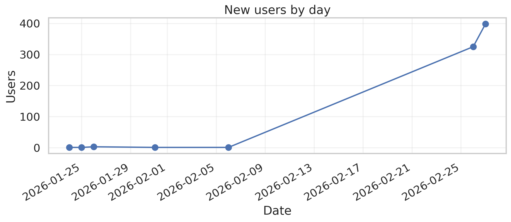
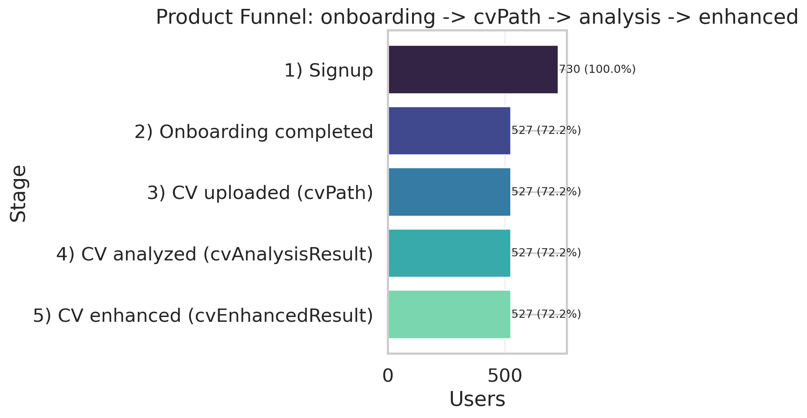

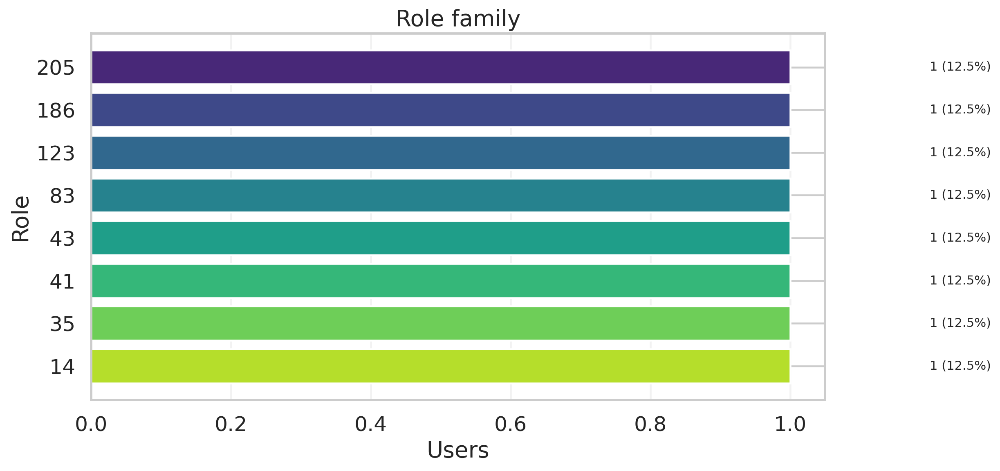
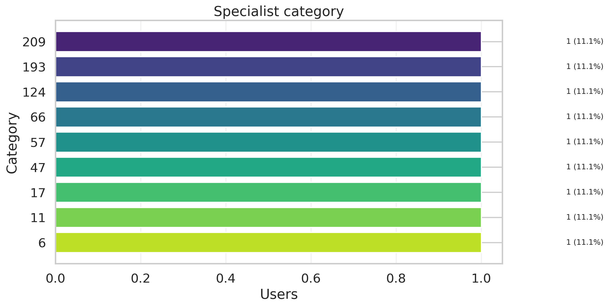
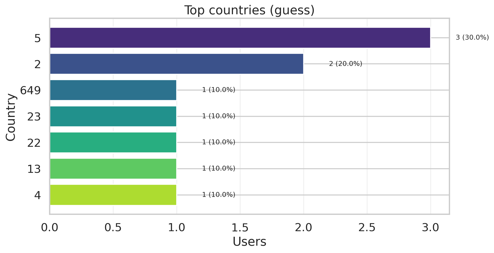
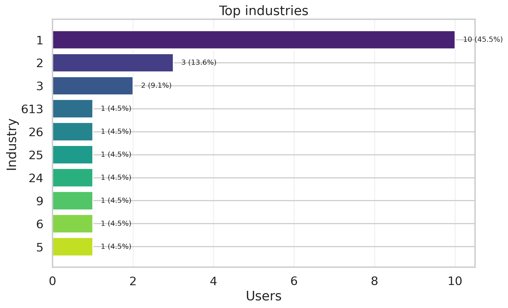
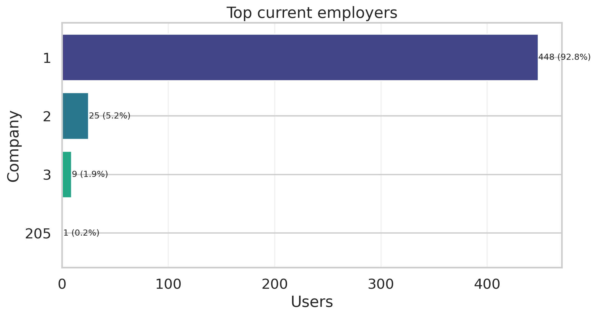
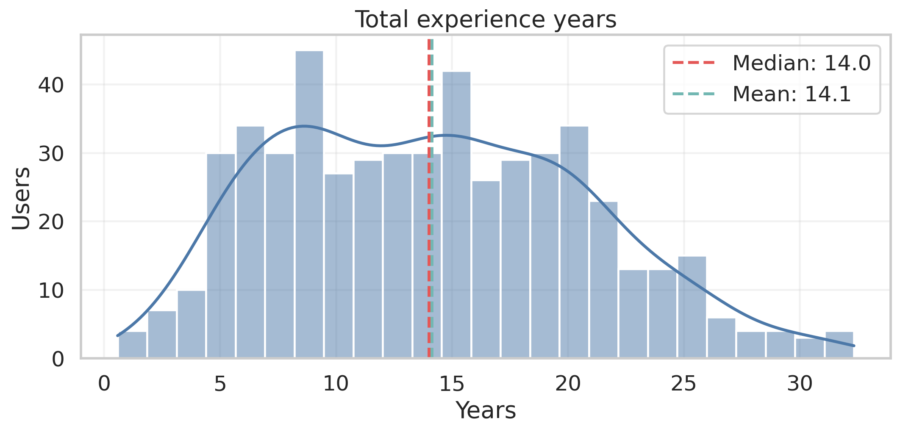
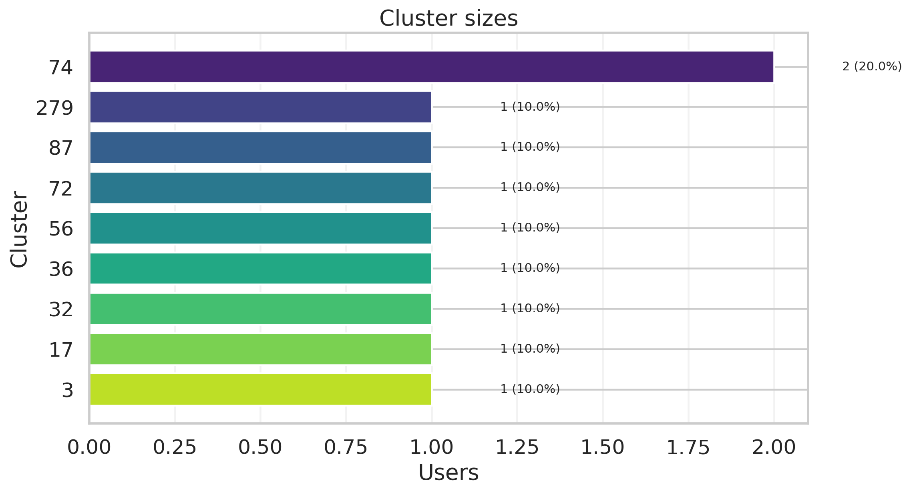
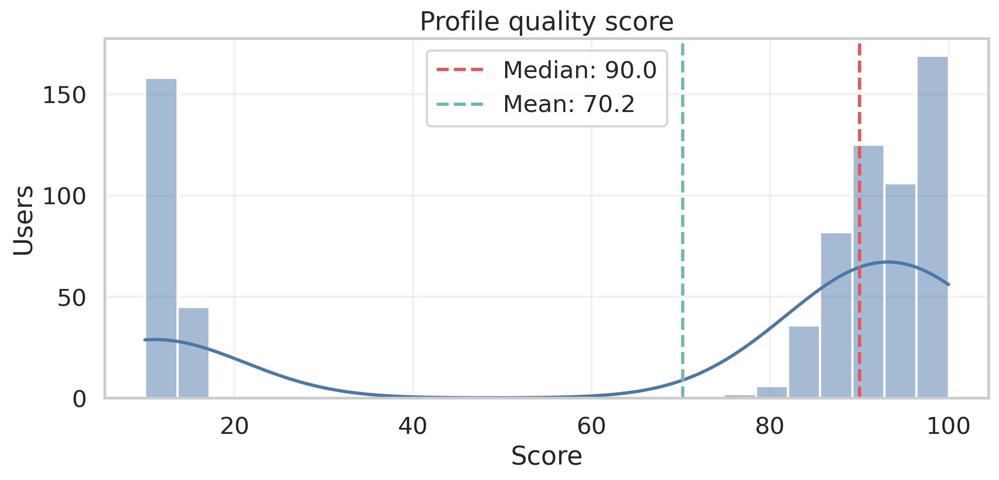

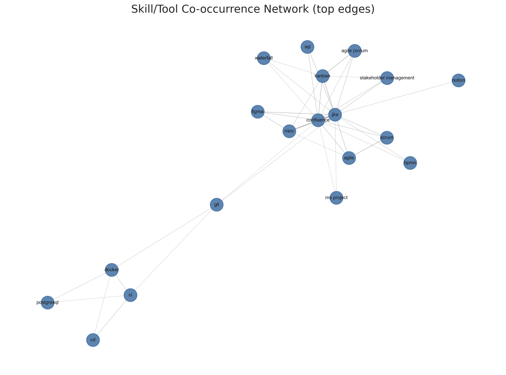
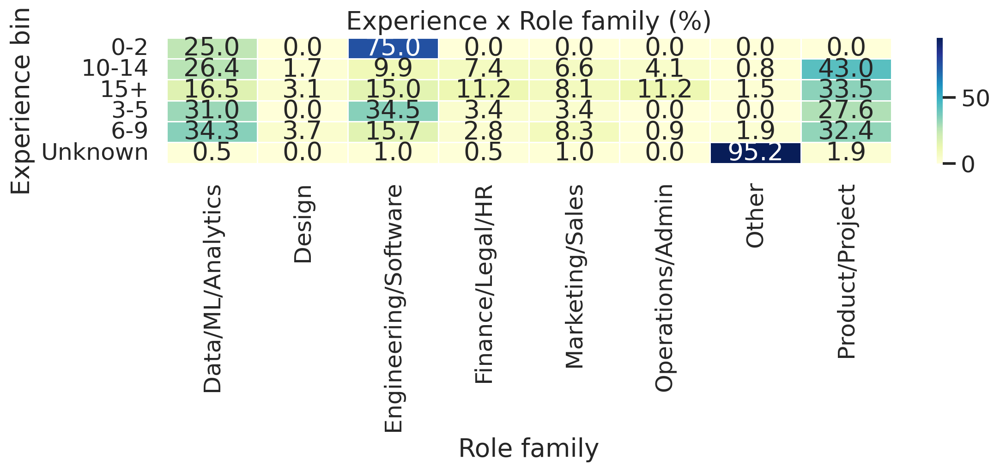


## 10) Appendix
### Data Dictionary (key fields)
- `createdAt`, `updatedAt`: жизненный цикл пользователя
- `onboardingCompleted`: завершение онбординга
- `cvPath`, `cvAnalysisResult`, `cvEnhancedResult`: этапы обработки CV
- `talentCard.jobs[i].*`: история работ
- `talentCard.overall_summary/skills/tools`: агрегированный профиль навыков
- `talentCard.specialist_category`: категория специалиста

### Generated Artifacts
- Aggregated tables: `outputs/tables/*.csv`
- Figures: `outputs/figures/*.png`

## How to reproduce
```bash
python analytics/mis_users_resume_bot/src/make_mis.py --input /Users/k/Downloads/prointerview-prod.users.csv --output analytics/mis_users_resume_bot/outputs
```
