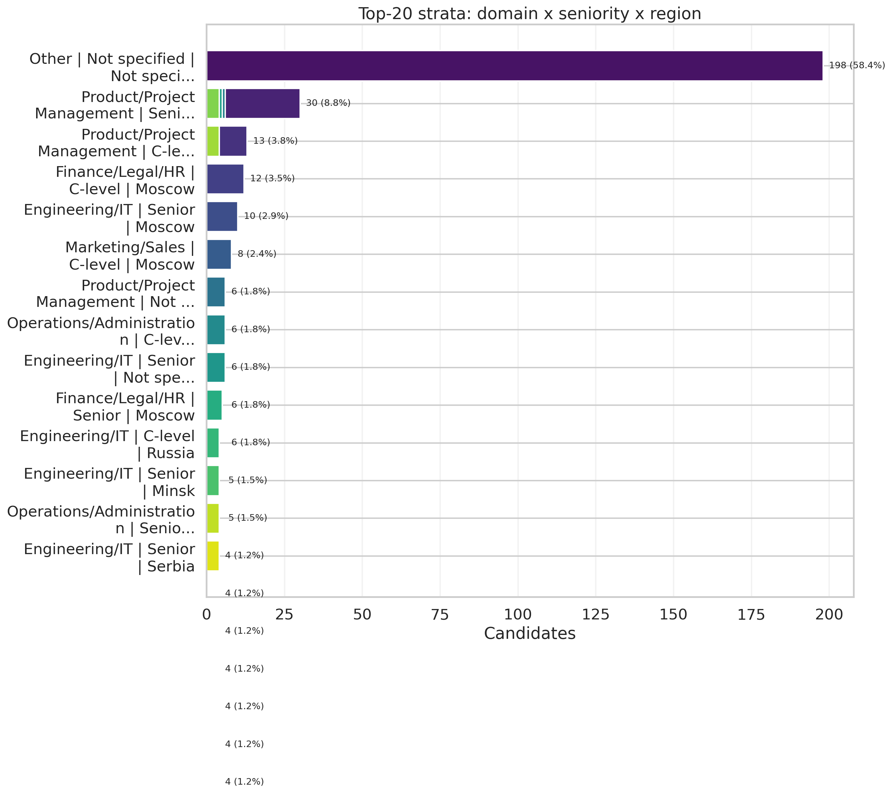

# MIS: Users Resume Bot (Candidate Analytics)

## 1) Summary
- Users total: **730**
- Coverage `cvEnhancedResult`: **72.2%**
- Coverage `talentCard.jobs`: **72.2%**
- Coverage `talentCard.overall_skills`: **72.2%**
- Coverage `talentCard.specialist_category`: **71.4%**

Top-3 domains:
| domain_filled              |   count |
|:---------------------------|--------:|
| Other                      |     209 |
| Product/Project Management |     193 |
| Engineering/IT             |     124 |

Top-3 regions:
| region_display   |   count |
|:-----------------|--------:|
| Not specified    |     241 |
| Москва           |     125 |
| Minsk, Belarus   |      26 |

Top-3 companies:
| company_display   |   count |
|:------------------|--------:|
| Not specified     |     203 |
| Сбер              |       4 |
| BostonGene        |       3 |

### Key observations
- База содержит 730 профилей.
- Покрытие `cvEnhancedResult`: 72.2%.
- Покрытие `talentCard.jobs`: 72.2%.
- Покрытие `talentCard.overall_skills`: 72.2%.
- Покрытие `talentCard.specialist_category`: 71.4%.
- LaTeX-парсинг нашел `ExpHeader` у 71.6% пользователей.
- LaTeX skills section найдена у 72.2% пользователей.
- Industry анализируется только на subset с заполненным industry: 15.9% пользователей.
- Топ tools: Jira, Confluence, Sql, Miro, Figma.

## 2) Coverage / Parsing validation
| metric                               |   value |
|:-------------------------------------|--------:|
| users_total                          |   730   |
| coverage_cvEnhancedResult_%          |    72.2 |
| coverage_talentCard_jobs_%           |    72.2 |
| coverage_overall_skills_%            |    72.2 |
| coverage_specialist_category_%       |    71.4 |
| coverage_industry_talentCard_%       |    15.9 |
| users_with_latex_block               |   527   |
| share_users_with_latex_block_%       |    72.2 |
| users_with_expheader                 |   523   |
| share_users_with_expheader_%         |    71.6 |
| users_with_skills_section            |   527   |
| share_users_with_skills_section_%    |    72.2 |
| users_with_languages_section         |   421   |
| share_users_with_languages_section_% |    57.7 |
| users_with_education_section         |    39   |
| share_users_with_education_section_% |     5.3 |
| company_comparable_users             |   521   |
| current_company_matches              |   493   |
| current_company_match_rate_%         |    94.6 |

Columns inventory (real CSV structure + non-null profile + length stats):
- `outputs/tables/columns_inventory.csv`

## 3) Domains & Geography


## 4) Companies & Seniority


## 5) Skills & Stack


## 6) Стратификация выборки




Ключевые таблицы стратификации:
- `outputs/tables/strata_top20.csv`
- `outputs/tables/domain_distribution.csv`
- `outputs/tables/role_family_distribution.csv`
- `outputs/tables/seniority_distribution.csv`
- `outputs/tables/experience_bin_distribution.csv`
- `outputs/tables/leadership_distribution.csv`
- `outputs/tables/cv_generation_language_distribution.csv`

## 7) Not specified diagnostics
| field     |   share_missing |   share_filled_by_fallback | source_breakdown                                                                            |
|:----------|----------------:|---------------------------:|:--------------------------------------------------------------------------------------------|
| domain    |             0   |                       28.6 | talentCard:71.4%; inferred:28.6%                                                            |
| region    |            33   |                       20.7 | latex_expheader:46.3%; not_specified:33.0%; latex_header:14.0%; talentCard:6.7%             |
| company   |            27.8 |                        0.5 | latex_expheader:71.6%; not_specified:27.8%; talentCard:0.5%                                 |
| seniority |            40.1 |                       30.7 | not_specified:40.1%; talentCard:29.2%; inferred_job_title:16.6%; inferred_header_role:14.1% |
| industry  |            84.1 |                        0   | not_specified:84.1%; talentCard:15.9%                                                       |

Пустоты уменьшались по fallback-цепочкам:
- `region_filled`: `latex_expheader -> talentCard -> latex_header`
- `seniority_filled`: `talentCard -> inferred_job_title -> inferred_header_role`
- `domain_filled`: `talentCard.specialist_category -> inferred role family`

## 8) Appendix
Артефакты:
- Figures: `outputs/figures/*.png`
- Tables: `outputs/tables/*.csv`
- Notebook: `notebooks/mis_users_resume_bot.ipynb`

How to reproduce:
```bash
python analytics/mis_users_resume_bot/src/build_mis.py   --input /mnt/data/prointerview-prod.users.csv   --base-dir analytics/mis_users_resume_bot
```
