# MIS: Users Resume Bot

## 1) MIS Summary
- Users total: **730**
- onboardingCompleted: **527** (72.2%)
- cvPath exists: **527** (72.2%)
- cvAnalysisStatus=completed: **329** (45.1%)
- cvEnhancedResult exists: **329** (45.1%)

Top-3 domains:
| domain                     |   count |
|:---------------------------|--------:|
| Not specified              |     209 |
| Product/Project Management |     193 |
| Engineering/IT             |     124 |

Top-3 regions:
| region_display   |   count |
|:-----------------|--------:|
| Not specified    |     343 |
| Москва           |      76 |
| Dubai, UAE       |      11 |

Top-3 companies:
| company_display           |   count |
|:--------------------------|--------:|
| Not specified             |     203 |
| Delta Distribution LLC    |       3 |
| S-HUB Startup Accelerator |       3 |

### Key observations
- `onboardingCompleted` у 527 из 730 пользователей (72.2%).
- До этапа `cvAnalysisStatus=completed` доходят 329 пользователей (45.1% от базы).
- `cvEnhancedResult` присутствует у 329 пользователей (45.1%).
- LaTeX с `\ExpHeader` распознан у 71.6% пользователей, skills-секция найдена у 72.2%.
- Согласованность current company между talentCard и LaTeX (нормализовано) составляет 85.5% среди сравнимых профилей.
- Топ-домен: Not specified (209 пользователей).
- Топ-регион (current): Not specified (343).
- Топ-компания (current): Not specified (203).
- Топ-индустрия current job: Not specified (614).
- Самые частые инструменты: Jira, Confluence, Sql, Miro, Figma.

## 2) Data Coverage & Quality
### Missingness (key fields)
| field                          |   missing_% |   filled_% |
|:-------------------------------|------------:|-----------:|
| talentCard.overall_tools       |        96.6 |        3.4 |
| banReason                      |        91.8 |        8.2 |
| cvAnalysisStatus               |        50.8 |       49.2 |
| talentCard.specialist_category |        28.6 |       71.4 |
| cvEnhancedResult               |        27.8 |       72.2 |
| talentCard.overall_summary     |        27.8 |       72.2 |
| talentCard.overall_skills      |        27.8 |       72.2 |
| cvPath                         |        21.4 |       78.6 |
| createdAt                      |         0   |      100   |
| updatedAt                      |         0   |      100   |
| onboardingCompleted            |         0   |      100   |
| isBanned                       |         0   |      100   |

### LaTeX parsing validation
| metric                              |   value |
|:------------------------------------|--------:|
| users_total                         |   730   |
| users_with_cvEnhancedResult         |   527   |
| share_users_with_cvEnhancedResult_% |    72.2 |
| users_with_expheader                |   523   |
| share_users_with_expheader_%        |    71.6 |
| users_with_skills_section           |   527   |
| share_users_with_skills_section_%   |    72.2 |
| company_comparable_users            |   523   |
| current_company_matches             |   447   |
| current_company_match_rate_%        |    85.5 |

### Jobs count comparison (talentCard vs LaTeX)
|   diff |   users |
|-------:|--------:|
|     -5 |       3 |
|     -4 |       8 |
|     -3 |      13 |
|     -2 |      30 |
|     -1 |      64 |
|      0 |     599 |
|      1 |       3 |
|      2 |       5 |
|      3 |       2 |
|      5 |       2 |
|      6 |       1 |

## 3) Domains & Geography
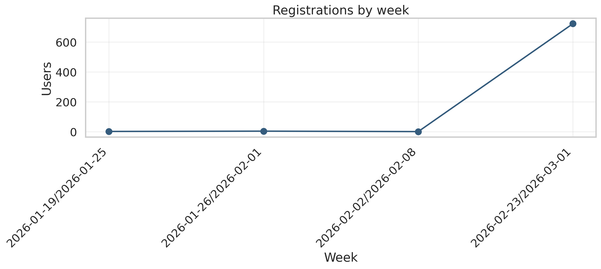
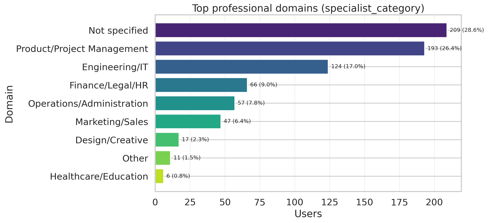
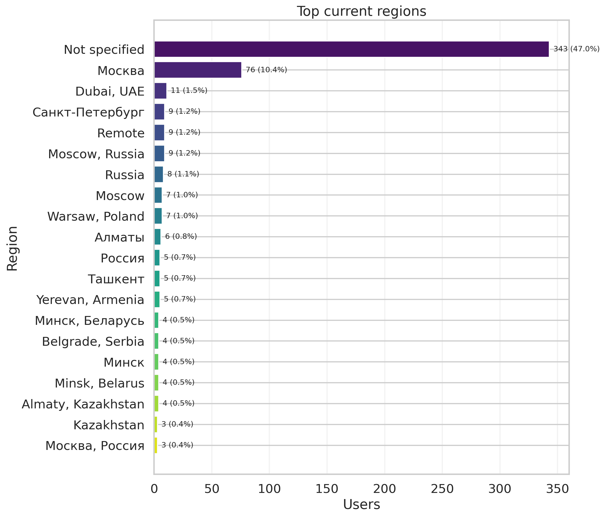
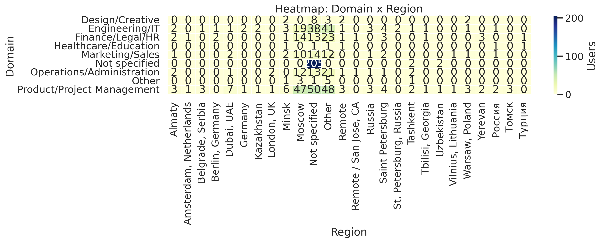

## 4) Companies & Seniority
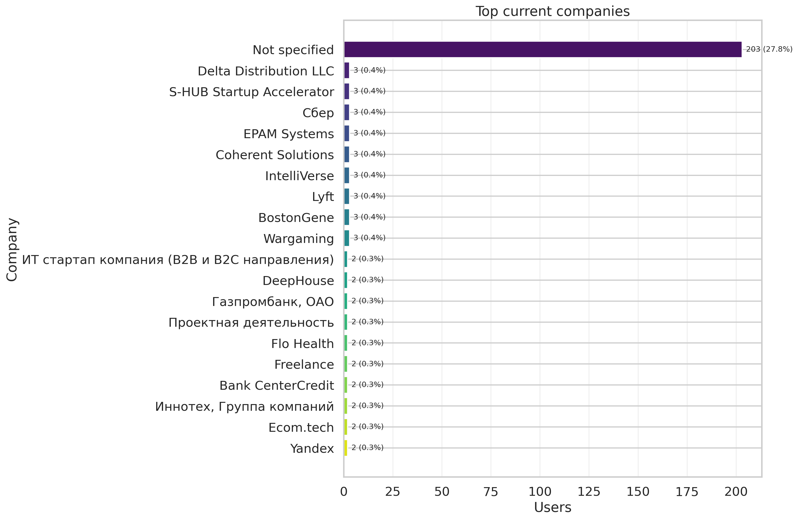

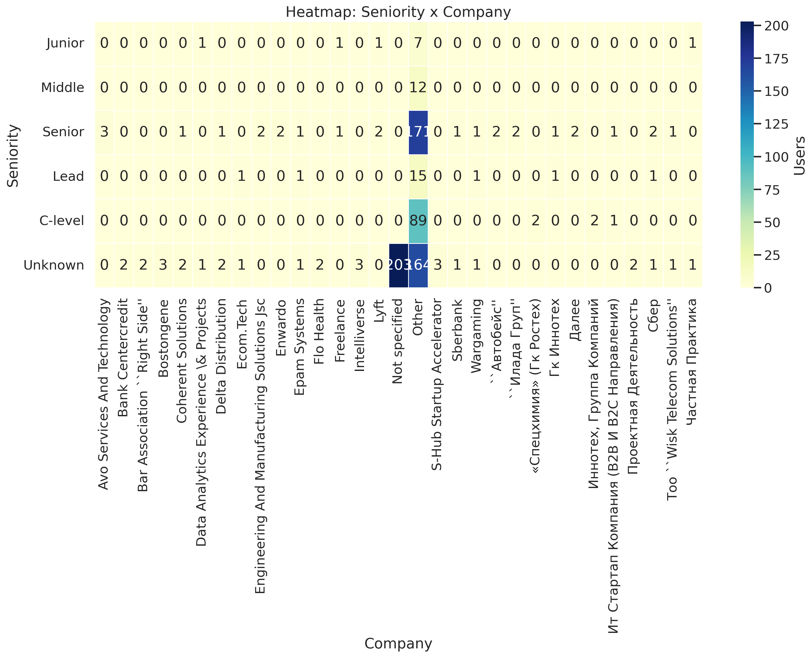
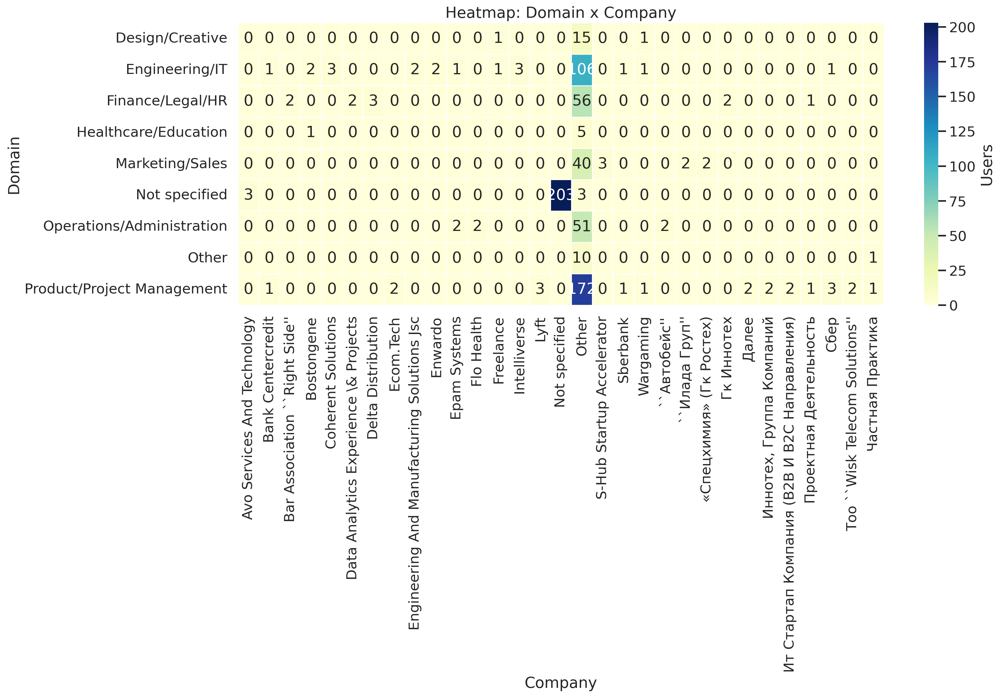

## 5) Skills & Stack
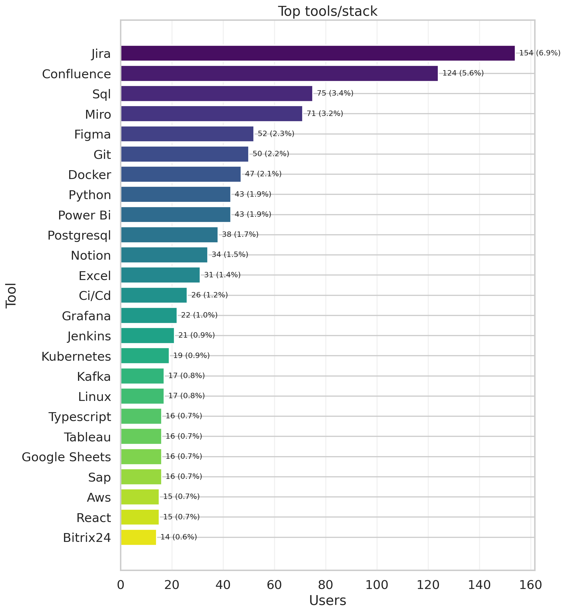
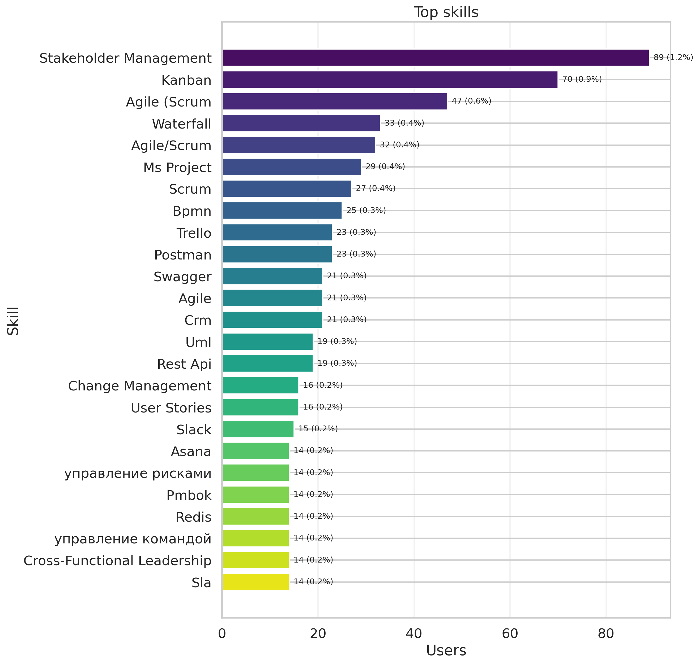
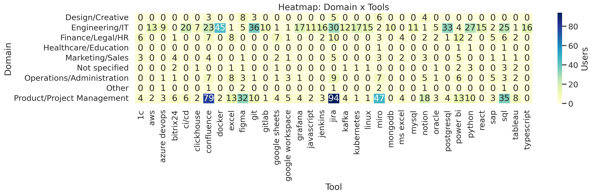

## 6) Product funnel and status
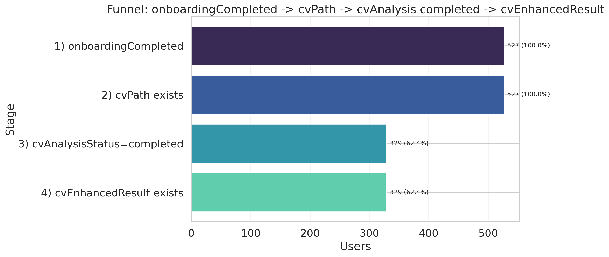
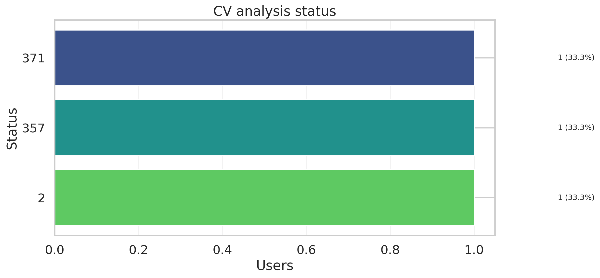
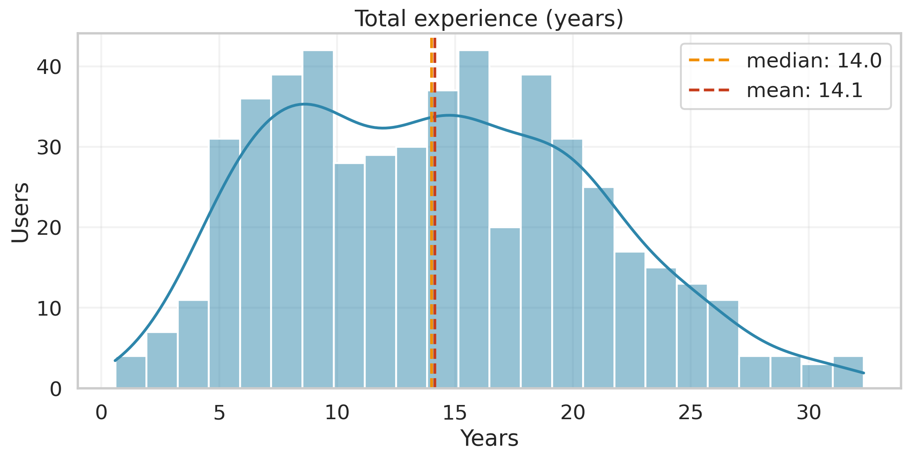
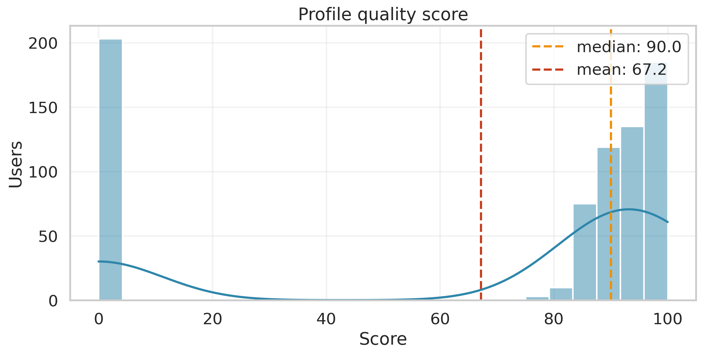

## 7) Appendix
Generated tables:
- `outputs/tables/validation_summary.csv`
- `outputs/tables/mismatch_samples.csv`
- `outputs/tables/region_mappings.csv`
- `outputs/tables/company_mappings.csv`
- `outputs/tables/industry_mappings.csv`
- `outputs/tables/domain_region_heatmap.csv`
- `outputs/tables/seniority_company_heatmap.csv`
- `outputs/tables/domain_tools_heatmap.csv`

How to reproduce:
```bash
/opt/anaconda3/bin/python analytics/mis_users_resume_bot/src/build_mis.py   --input /Users/k/Downloads/prointerview-prod.users.csv   --base-dir analytics/mis_users_resume_bot
```
