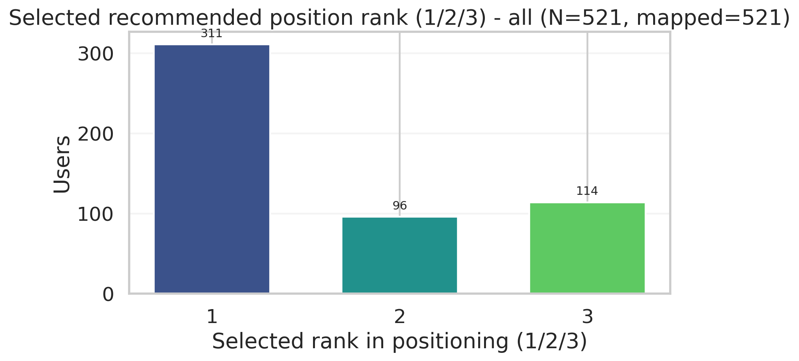
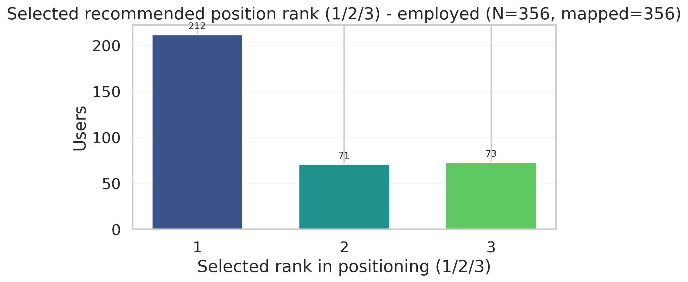
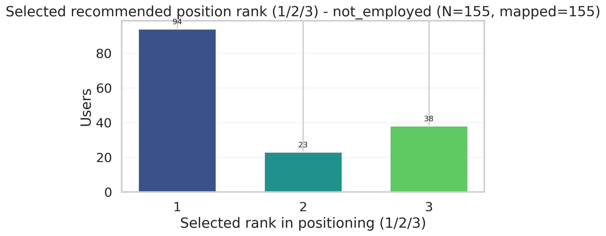
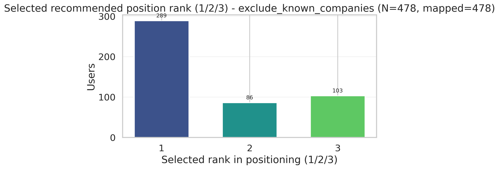

# Position Choice Report (rank 1/2/3)

## Sample
- Cohort: `createdAt` UTC `2026-02-26` — `2026-02-27`
- Sample: только пользователи с LaTeX CV (`cvEnhancedResult`)
- Users total: **521**

## Логика rank
- Из `cvAnalysisResult` берется массив `positioning` (первые 3 элемента).
- Для каждого элемента используется только поле `position`.
- `selectedPosition` нормализуется и маппится в номер позиции: `1` / `2` / `3`.
- Если `selectedPosition` не сопоставляется с одной из 3 позиций, пользователь исключается из rank-распределений.

## Coverage
| group | total_users | with_cvAnalysisResult_nonnull | with_positions3 | with_selected_mapped | share_mapped_% |
|---|---:|---:|---:|---:|---:|
| all | 521 | 521 | 521 | 521 | 100.0 |
| employed | 356 | 356 | 356 | 356 | 100.0 |
| not_employed | 155 | 155 | 155 | 155 | 100.0 |
| exclude_known_companies | 478 | 478 | 478 | 478 | 100.0 |

## Excluded Companies (для группы `exclude_known_companies`)
- Excluded known companies list: `src/known_companies.py`
- Топ исключённых по количеству: `Сбер (7), EPAM (4), Яндекс (3), Avito (2), PWC (2), Газпромбанк (2), VK (1), ernst and young (1), luxoft (1), sbertech (1), wildberries (1), БАНК (1), ВТБ (1), Газпром (1), Лаборатория Касперского (1)`
- Детализация: `outputs/tables/position_choice_excluded_companies.csv`
- Полный список канонических исключений и алиасов: `outputs/tables/position_choice_excluded_known_list.csv`

## Distribution: All
| rank | count | share_% |
|---:|---:|---:|
| 1 | 311 | 59.7 |
| 2 | 96 | 18.4 |
| 3 | 114 | 21.9 |

## Distribution: Employed
| rank | count | share_% |
|---:|---:|---:|
| 1 | 212 | 59.6 |
| 2 | 71 | 19.9 |
| 3 | 73 | 20.5 |

## Distribution: Not Employed
| rank | count | share_% |
|---:|---:|---:|
| 1 | 94 | 60.6 |
| 2 | 23 | 14.8 |
| 3 | 38 | 24.5 |

## Distribution: Employed + Not Employed (excluding known companies)
| rank | count | share_% |
|---:|---:|---:|
| 1 | 289 | 60.5 |
| 2 | 86 | 18.0 |
| 3 | 103 | 21.5 |

## Artifacts
- `outputs/tables/position_choice_coverage.csv`
- `outputs/tables/position_choice_plot_status.csv`
- `outputs/tables/position_choice_excluded_companies.csv`
- `outputs/tables/position_choice_excluded_known_list.csv`
- `outputs/tables/position_choice_rank_distribution_all.csv`
- `outputs/tables/position_choice_rank_distribution_employed.csv`
- `outputs/tables/position_choice_rank_distribution_not_employed.csv`
- `outputs/tables/position_choice_rank_distribution_exclude_known_companies.csv`
