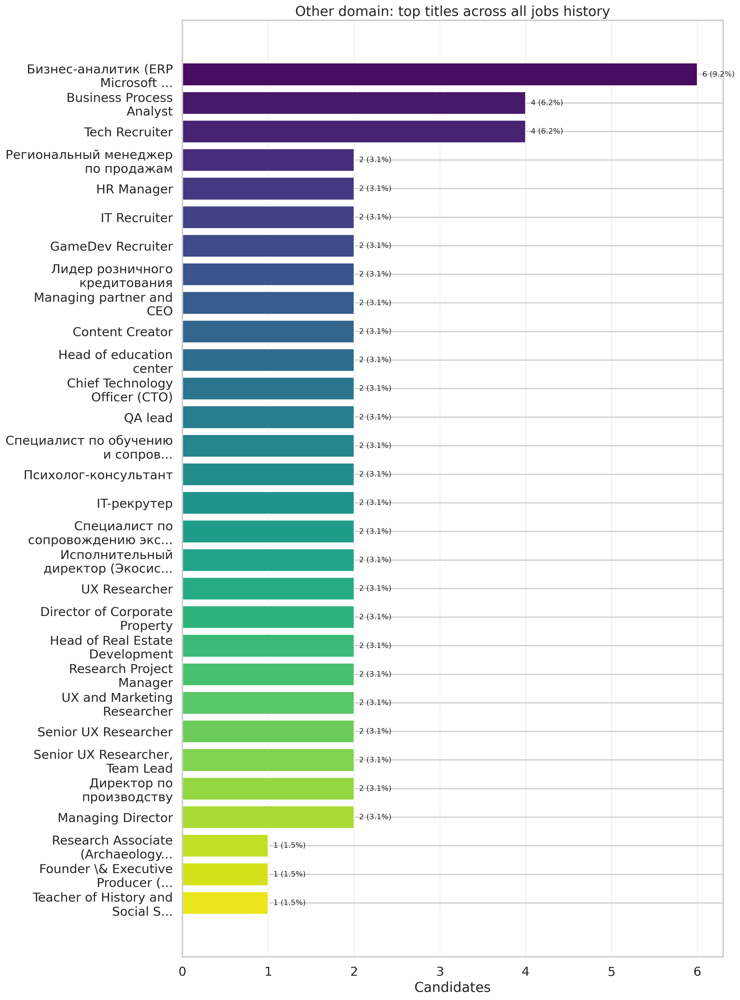
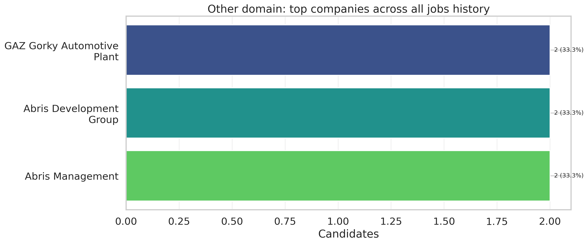
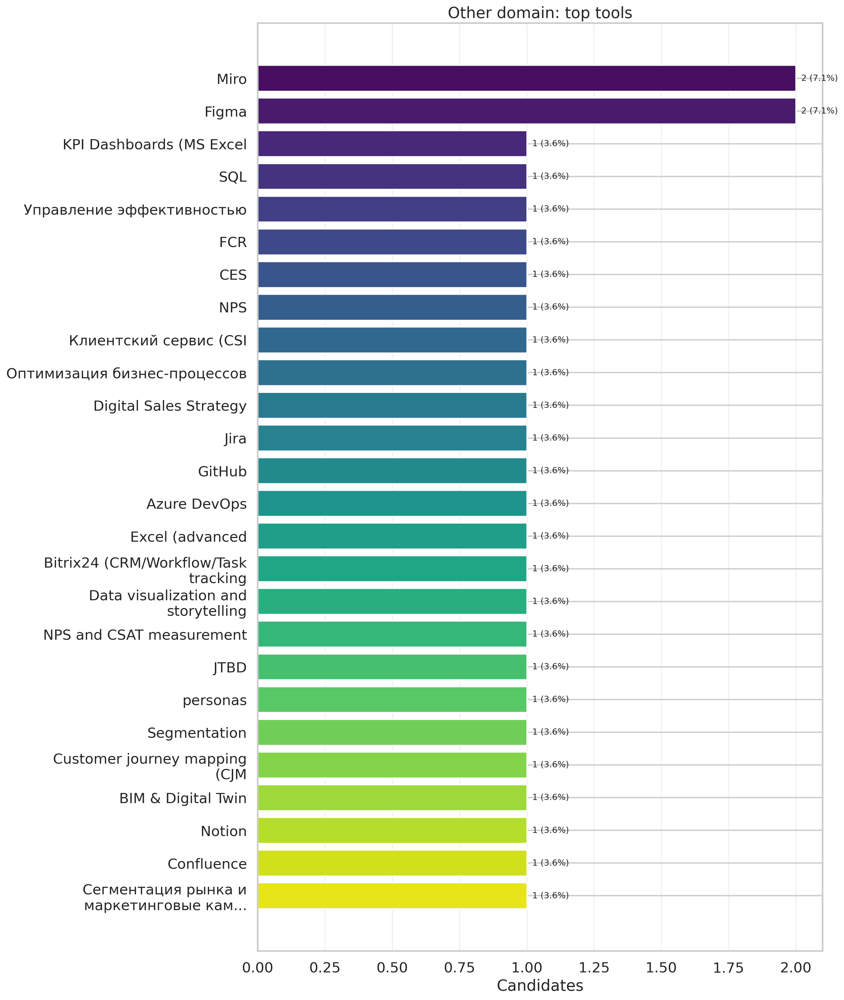
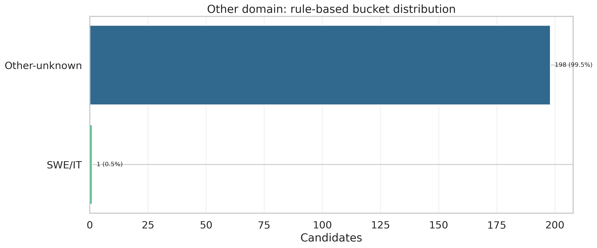

# REPORT_OTHERS: Domain Other Deep Dive

## 1) Size
- Other users: **209**
- Share of all users: **28.6%**
- Other users with `cvEnhancedResult`: **11**
- Share among users with `cvEnhancedResult`: **2.1%**

## 2) Coverage
| metric                               |   value |
|:-------------------------------------|--------:|
| other_users_total                    |   209   |
| share_all_users_%                    |    28.6 |
| other_users_with_cvEnhancedResult    |    11   |
| share_among_cvEnhancedResult_users_% |     2.1 |
| jobs_latex_present_%                 |     5.3 |
| jobs_talent_present_%                |     5.3 |
| skills_or_tools_present_%            |     5.3 |
| region_specified_%                   |     5.3 |
| seniority_specified_%                |     4.8 |

## 3) Who Are These Candidates
Top-30 titles across all jobs history:
| job_title                                                                                                                                  |   count |   share_% |
|:-------------------------------------------------------------------------------------------------------------------------------------------|--------:|----------:|
| Бизнес-аналитик (ERP Microsoft Dynamics NAV)                                                                                               |       6 |       9.2 |
| Business Process Analyst                                                                                                                   |       4 |       6.2 |
| Tech Recruiter                                                                                                                             |       4 |       6.2 |
| Региональный менеджер по продажам                                                                                                          |       2 |       3.1 |
| HR Manager                                                                                                                                 |       2 |       3.1 |
| IT Recruiter                                                                                                                               |       2 |       3.1 |
| GameDev Recruiter                                                                                                                          |       2 |       3.1 |
| Лидер розничного кредитования                                                                                                              |       2 |       3.1 |
| Managing partner and CEO                                                                                                                   |       2 |       3.1 |
| Content Creator                                                                                                                            |       2 |       3.1 |
| Head of education center                                                                                                                   |       2 |       3.1 |
| Chief Technology Officer (CTO)                                                                                                             |       2 |       3.1 |
| QA lead                                                                                                                                    |       2 |       3.1 |
| Специалист по обучению и сопровождению                                                                                                     |       2 |       3.1 |
| Психолог-консультант                                                                                                                       |       2 |       3.1 |
| IT-рекрутер                                                                                                                                |       2 |       3.1 |
| Специалист по сопровождению экспортных продаж                                                                                              |       2 |       3.1 |
| Исполнительный директор (Экосистема недвижимости Домклик)                                                                                  |       2 |       3.1 |
| UX Researcher                                                                                                                              |       2 |       3.1 |
| Director of Corporate Property                                                                                                             |       2 |       3.1 |
| Head of Real Estate Development                                                                                                            |       2 |       3.1 |
| Research Project Manager                                                                                                                   |       2 |       3.1 |
| UX and Marketing Researcher                                                                                                                |       2 |       3.1 |
| Senior UX Researcher                                                                                                                       |       2 |       3.1 |
| Senior UX Researcher, Team Lead                                                                                                            |       2 |       3.1 |
| Директор по производству                                                                                                                   |       2 |       3.1 |
| Managing Director                                                                                                                          |       2 |       3.1 |
| Research Associate (Archaeology): organized and supervised field expeditions; scientific analysis, reporting, and presentation of results. |       1 |       1.5 |
| Founder \& Executive Producer (Self-employed)                                                                                              |       1 |       1.5 |
| Teacher of History and Social Studies: project-based teaching; supported heterogeneous learning groups and special educational needs.      |       1 |       1.5 |

Top-20 current titles:
| current_job_title_filled                                                                |   count |   share_% |
|:----------------------------------------------------------------------------------------|--------:|----------:|
| Not specified                                                                           |     198 |      94.7 |
| Business Process Analyst                                                                |       1 |       0.5 |
| Директор по производству                                                                |       1 |       0.5 |
| Head of Real Estate Development                                                         |       1 |       0.5 |
| Senior UX Researcher, Team Lead                                                         |       1 |       0.5 |
| Independent Research (migration \& education)                                           |       1 |       0.5 |
| Head of Video Production (07.2024 -- 12.2025) \,|\, Video Producer (12.2023 -- 07.2024) |       1 |       0.5 |
| Бизнес-аналитик (ERP Microsoft Dynamics NAV)                                            |       1 |       0.5 |
| GameDev Recruiter                                                                       |       1 |       0.5 |
| Лидер розничного кредитования                                                           |       1 |       0.5 |
| Managing partner and CEO                                                                |       1 |       0.5 |
| Психолог-консультант                                                                    |       1 |       0.5 |

Top-30 companies across all jobs history:
| company                                                                   |   count |   share_% |
|:--------------------------------------------------------------------------|--------:|----------:|
| ЧП «ШАТЕ-М ПЛЮС»                                                          |       6 |       8.8 |
| ООО "ЛАНИТ-Интеграция"                                                    |       4 |       5.9 |
| ООО ``ЛАНИТ-Интеграция''                                                  |       3 |       4.4 |
| Revizto --- Global BIM Collaboration Platform                             |       3 |       4.4 |
| Luxoft                                                                    |       2 |       2.9 |
| Top Selection (Consulting Agency)                                         |       2 |       2.9 |
| SberKorus                                                                 |       2 |       2.9 |
| Restaurant and Cafe Chain                                                 |       2 |       2.9 |
| R-Style Softlab                                                           |       2 |       2.9 |
| WN Talents                                                                |       2 |       2.9 |
| Национальный банк внешнеэкономической деятельности Республики Узбекистана |       2 |       2.9 |
| Сбер                                                                      |       2 |       2.9 |
| STRATOPLAN MANAGEMENT SCHOOL                                              |       2 |       2.9 |
| Rolling Moto                                                              |       2 |       2.9 |
| ООО «СТО СОФТ»                                                            |       2 |       2.9 |
| QAExpert                                                                  |       2 |       2.9 |
| VDI                                                                       |       2 |       2.9 |
| UMC                                                                       |       2 |       2.9 |
| DevZeroG                                                                  |       2 |       2.9 |
| TechnoInfoService                                                         |       2 |       2.9 |
| ABC                                                                       |       2 |       2.9 |
| Частная практика                                                          |       2 |       2.9 |
| amoCRM                                                                    |       2 |       2.9 |
| Yandex                                                                    |       2 |       2.9 |
| Innotech                                                                  |       2 |       2.9 |
| Peaceful Lights (Annual Music Film)                                       |       2 |       2.9 |
| Institute for Northern Archaeology (Russia)                               |       2 |       2.9 |
| GAZ Gorky Automotive Plant                                                |       2 |       2.9 |
| Abris Development Group                                                   |       2 |       2.9 |
| Abris Management                                                          |       2 |       2.9 |

Most frequent title keywords:
| title_keyword                                 |   count |   share_% |
|:----------------------------------------------|--------:|----------:|
| бизнес                                        |       6 |       7.5 |
| аналитик                                      |       6 |       7.5 |
| erp microsoft dynamics nav                    |       6 |       7.5 |
| business process analyst                      |       4 |       5   |
| 07.2024                                       |       4 |       5   |
| tech recruiter                                |       4 |       5   |
| senior ux researcher                          |       4 |       5   |
| исполнительный директор                       |       2 |       2.5 |
| associate producer                            |       2 |       2.5 |
| line producer                                 |       2 |       2.5 |
| volunteer                                     |       2 |       2.5 |
| специалист по сопровождению экспортных продаж |       2 |       2.5 |
| hr manager                                    |       2 |       2.5 |
| it recruiter                                  |       2 |       2.5 |
| gamedev recruiter                             |       2 |       2.5 |
| лидер розничного кредитования                 |       2 |       2.5 |
| экосистема недвижимости домклик               |       2 |       2.5 |
| employed                                      |       2 |       2.5 |
| региональный менеджер по продажам             |       2 |       2.5 |
| managing partner and ceo                      |       2 |       2.5 |
| head of education center                      |       2 |       2.5 |
| chief technology officer                      |       2 |       2.5 |
| cto                                           |       2 |       2.5 |
| ceo and co                                    |       2 |       2.5 |
| qa lead                                       |       2 |       2.5 |
| специалист по обучению и сопровождению        |       2 |       2.5 |
| психолог                                      |       2 |       2.5 |
| ведущий инженер                               |       2 |       2.5 |
| рекрутер                                      |       2 |       2.5 |
| тест                                          |       2 |       2.5 |

## 4) Skills & Stack
Top tools:
| tool                                       |   count |   share_% |
|:-------------------------------------------|--------:|----------:|
| Miro                                       |       2 |       7.1 |
| Figma                                      |       2 |       7.1 |
| KPI Dashboards (MS Excel                   |       1 |       3.6 |
| SQL                                        |       1 |       3.6 |
| Управление эффективностью                  |       1 |       3.6 |
| FCR                                        |       1 |       3.6 |
| CES                                        |       1 |       3.6 |
| NPS                                        |       1 |       3.6 |
| Клиентский сервис (CSI                     |       1 |       3.6 |
| Оптимизация бизнес-процессов               |       1 |       3.6 |
| Digital Sales Strategy                     |       1 |       3.6 |
| Jira                                       |       1 |       3.6 |
| GitHub                                     |       1 |       3.6 |
| Azure DevOps                               |       1 |       3.6 |
| Excel (advanced                            |       1 |       3.6 |
| Bitrix24 (CRM/Workflow/Task tracking       |       1 |       3.6 |
| Data visualization and storytelling        |       1 |       3.6 |
| NPS and CSAT measurement                   |       1 |       3.6 |
| JTBD                                       |       1 |       3.6 |
| personas                                   |       1 |       3.6 |
| Segmentation                               |       1 |       3.6 |
| Customer journey mapping (CJM              |       1 |       3.6 |
| BIM & Digital Twin                         |       1 |       3.6 |
| Notion                                     |       1 |       3.6 |
| Confluence                                 |       1 |       3.6 |
| Сегментация рынка и маркетинговые кампании |       1 |       3.6 |

Top skills:
| skill                                        |   count |   share_% |
|:---------------------------------------------|--------:|----------:|
| UML                                          |       2 |       6.5 |
| Business Analysis                            |       1 |       3.2 |
| Xmind                                        |       1 |       3.2 |
| спецификации                                 |       1 |       3.2 |
| инструкции                                   |       1 |       3.2 |
| API                                          |       1 |       3.2 |
| Взаимодействие с разработкой и тестированием |       1 |       3.2 |
| ServiceDesk                                  |       1 |       3.2 |
| Redmine                                      |       1 |       3.2 |
| Bizagi Modeler                               |       1 |       3.2 |
| Немецкий язык (B2                            |       1 |       3.2 |
| Use Case                                     |       1 |       3.2 |
| Full-cycle recruiting                        |       1 |       3.2 |
| Stakeholder management                       |       1 |       3.2 |
| Sourcing (LinkedIn                           |       1 |       3.2 |
| Telegram                                     |       1 |       3.2 |
| Habr                                         |       1 |       3.2 |
| niche communities                            |       1 |       3.2 |
| Техническое задание                          |       1 |       3.2 |
| BPMN 2.0                                     |       1 |       3.2 |
| Screening & behavioral interviews            |       1 |       3.2 |
| Budgeting & Cost Optimization                |       1 |       3.2 |
| R (fundamentals                              |       1 |       3.2 |
| currently refreshing                         |       1 |       3.2 |
| Video Production Leadership                  |       1 |       3.2 |
| Creative Development (briefs                 |       1 |       3.2 |
| scripting                                    |       1 |       3.2 |
| Line Producing & Crew Management             |       1 |       3.2 |
| Global Remote/On-site Production             |       1 |       3.2 |
| Сбор и анализ требований (бизнес и системные |       1 |       3.2 |

## 5) Geography & Seniority
Top regions:
| region_norm           |   count |   share_% |
|:----------------------|--------:|----------:|
| Not specified         |     198 |      94.7 |
| Moscow                |       3 |       1.4 |
| Russia                |       1 |       0.5 |
| Rome, Italy           |       1 |       0.5 |
| Berlin                |       1 |       0.5 |
| Remote, International |       1 |       0.5 |
| Minsk                 |       1 |       0.5 |
| Israel                |       1 |       0.5 |
| Tashkent              |       1 |       0.5 |
| Лиссабон, Португалия  |       1 |       0.5 |

Seniority:
| seniority_filled   |   count |   share_% |
|:-------------------|--------:|----------:|
| Not specified      |     199 |      95.2 |
| C-level            |       4 |       1.9 |
| Junior             |       2 |       1   |
| Lead               |       2 |       1   |
| Senior             |       1 |       0.5 |
| Middle             |       1 |       0.5 |

## 6) Rule-Based Buckets
| bucket         |   count |   share_% |
|:---------------|--------:|----------:|
| Other-unknown  |     198 |      94.7 |
| Data/Analytics |       6 |       2.9 |
| SWE/IT         |       5 |       2.4 |

## 7) Figures

## 8) Appendix
- Tables: `outputs/others/tables/*.csv`
- Figures: `outputs/others/figures/*.png`
